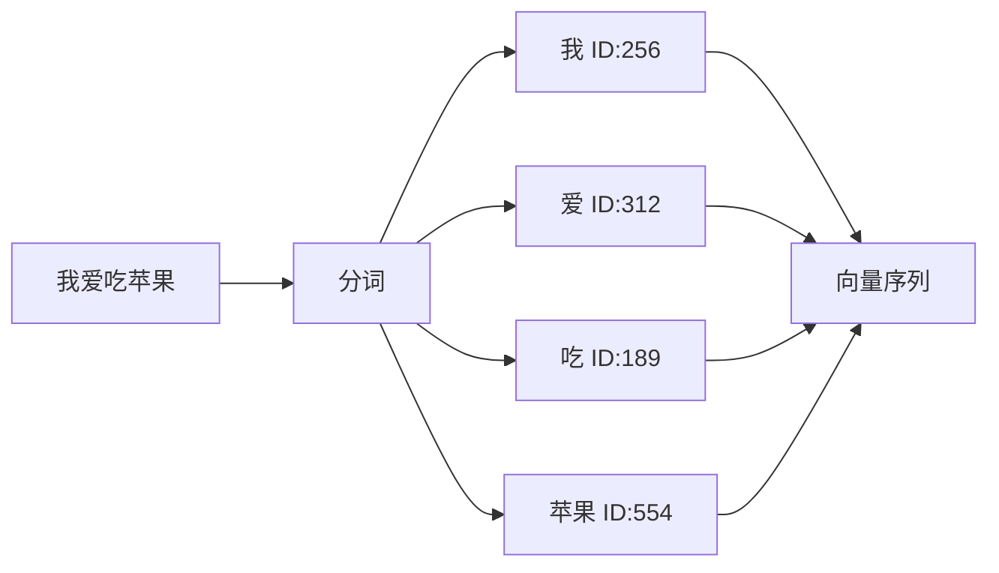
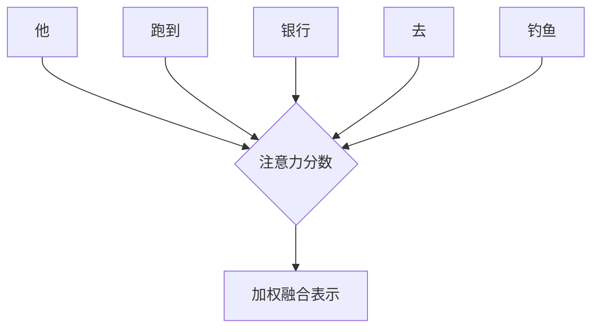
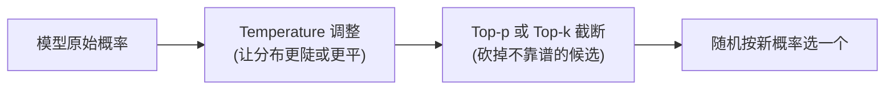
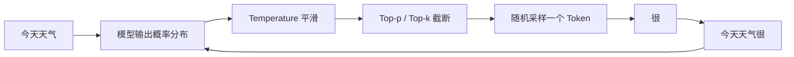
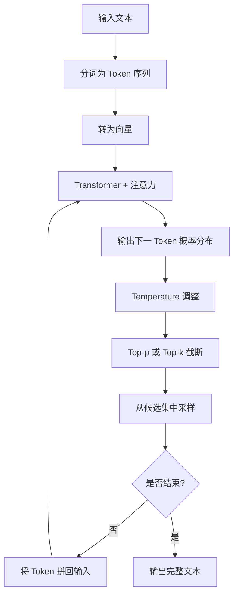

# 大语言模型原理：比你想象中更简单的“下一词预测”
## 引言
你有没有玩过手机输入法？你打一个“我”，它猜下一个字可能是“想”、“是”、“爱”。
现在，想象一下：
> 有一个输入法，它读完了互联网上几乎所有的书、论文、代码、聊天记录。
> 然后它用这些海量知识来“猜”你希望它说的下一个字。
——这就是大语言模型（LLM）。
它不思考，不 Feeling，不真正“理解”。
它只做一件事，但做到了极致：
**预测下一个字（更准确说是 Token）。**
---
## 1. 从文本到数字：Token 分词
计算机不认识文字，只认识数字。所以第一步，是把原始文本拆成更小的单元——**Token**。
> Token 可以是词、子词，甚至单个字符。
例如：
```
“我爱吃苹果” → [“我”, “爱”, “吃”, “苹果”]
```
每个 Token 会被映射到一个唯一的 ID（整数），然后再转成模型能计算的**向量**。

> **Token 就像把一句话剪成一个个拼图块，模型拿着拼图块做预测。**
---
## 2. 核心大脑：Transformer 与注意力机制
得到 Token 向量后，模型用 **Transformer 结构** 进行处理。Transformer 最关键的发明是 **自注意力机制**。
> 注意力机制让模型能够看到上下文中的所有 Token，并自动判断哪些 Token **对预测下一个 Token 更重要**。
举个例子：
> “他跑到银行去**钓鱼**。”
模型在计算 `钓鱼` 这个 Token 的表示时，会强烈关注前面的 `银行` 吗？
—— 不一定。这里的 `钓鱼` 是诈骗含义，可能需要关注 `跑到` 和 `他`。
注意力机制会**动态计算**每对 Token 之间的“关联分数”。

这种机制使得模型能理解长距离依赖和复杂的语法、语义关系。
> **注意力机制就像你读句子时，遇到关键词会不自觉回看前面的内容。**
---
## 3. 输出下一个 Token 的概率
模型经过几十层 Transformer 处理后，最后会得到一个**概率分布**：
> 在给定当前所有 Token 的情况下，下一个 Token 可能是什么？每个候选 Token 的概率是多少？
例如，输入 `今天天气` → 模型输出：
| Token | 概率 |
| ----- | ---- |
| 很    | 45%  |
| 真    | 20%  |
| 不    | 15%  |
| ……  | …   |
如果直接选最高概率（45% 的 `很`），这叫**贪婪解码**。但这样做出来的文本常常很呆板、重复。
为了让生成的内容更有趣、更多样，我们引入了三个“控制旋钮”：**Temperature**、**Top‑k**、**Top‑p**。
---
## 4. 控制创造力：Temperature、Top‑k、Top‑p
这三个参数**不改变模型学到的概率顺序**，而是改变**采样时如何从概率分布中挑选下一个 Token**。
### 🌡️ Temperature（温度）
Temperature 是一个除数，用来**平滑或锐化概率分布**。
- **T → 0**：概率高的 Token 更高，低概率的几乎为零 → 输出**确定、保守**
- **T = 1**：原始概率分布不变
- **T > 1**：高概率 Token 被压制，低概率 Token 被抬升 → 输出**更随机、更“有创意”**（但也可能胡言乱语）
> **温度越低，模型越“老实”；温度越高，模型越“敢瞎编”。**
---
### 🔝 Top‑k
Top‑k 是最简单的截断方法：**只保留概率最高的 k 个 Token**，然后把它们的概率重新归一化，其他 Token 概率设为 0。
例如 k=3 时：
```
原分布：猫 50% / 狗 25% / 鸟 13% / 鱼 7% / 其他 5%
保留 top‑3：猫 50% / 狗 25% / 鸟 13% → 重新归一化为 57% / 28% / 15%
```
- k 越小 → 输出越安全、可预测
- k 越大 → 允许更多低概率 Token 被选中
**常用值**：k=40 或 k=50（兼顾多样性与合理性）
---
### 🎲 Top‑p（也称核采样，Nucleus Sampling）
Top‑p 不固定数量，而是**按概率从高到低累加，直到累计概率达到 p**，只从这一组 Token 中采样。
例如 p=0.9：
```
累加过程：猫 50% (累计50%) → 狗 25% (累计75%) → 鸟 13% (累计88%) → 鱼 7% (累计95% > 90%)
所以采样池 = {猫, 狗, 鸟, 鱼}，鱼虽然只有 7%，也被包含进来。
```
- p 越小 → 候选集越小，输出更稳
- p 越大 → 候选集越大，输出更丰富
**常用值**：p=0.9 或 0.95
---
### 三者如何配合使用？
在实际生成中，通常是：
> **先应用 Temperature 调整分布 → 再应用 Top‑p 或 Top‑k 截断 → 最后采样**

常见组合：
| 场景                 | Temperature | Top‑p | Top‑k |
| -------------------- | ----------- | ------ | ------ |
| 代码生成 / 事实问答  | 0.1 ~ 0.3   | 0.9    | 40     |
| 创意写作 / 故事生成  | 0.7 ~ 1.0   | 0.92   | 60     |
| 极其发散（头脑风暴） | 1.2 ~ 1.5   | 0.95   | 100    |
> ⚠️ 注意：**Top‑p 和 Top‑k 一般不同时使用**，多数 API 让你选一个。Temperature 可以和任一搭配。
---
## 5. 自回归生成：一次一步，循环往复
现在，我们把采样参数加入生成流程：
1. 模型输出概率分布
2. 用 **Temperature** 调整分布
3. 用 **Top‑p / Top‑k** 截断候选集
4. 从候选集中按新概率随机采样下一个 Token
5. 将 Token 拼回输入
6. 重复 1–5，直到遇到结束符或达到长度上限

这些参数解释了为什么同一个模型可以：
- 作为搜索引擎时 **稳定且精确**（低温度 + 小 Top‑p）
- 作为写诗机器人时 **天马行空**（高温度 + 大 Top‑p）
---
## 6. 这个简单原理如何造就“智能”？
你可能会有疑问：仅仅是预测下一个词，怎么可能写出论文、解数学题、甚至懂得“推理”？
答案藏在**规模效应**里：
| 维度     | 规模                     | 类比                         |
| -------- | ------------------------ | ---------------------------- |
| 训练数据 | 数万亿 Token             | 一个人读完 100 万本书        |
| 模型参数 | 1 亿\~ 1.8 万亿          | 大脑里有几百亿个“小神经元” |
| 训练时间 | 几个月，用成千上万块显卡 | 几万名学生同时学习好几年     |
当模型在如此海量的数据上做“下一词预测”时，它**被迫学会**了：
* 语法（至少词序要像人类）
* 常识（太阳从东边升起）
* 逻辑（如果 A 能推出 B）
* 甚至多步推理（通过模仿训练数据里的“我们先这样想...”）
> **预测下一个词，需要理解整个世界。**
---
## 7. 一张图总结全流程

---
## 总结：一句话记住 LLM 的原理
> **一个读遍互联网的“猜词天才”，用注意力机制理解上下文，通过三个旋钮控制创造力，一次次猜下一个词，一个字一个字拼出回答。**
它不是魔法，不是意识，也不是真的“理解”。
但它用了一个极其简单的规则 + 极其巨大的规模，做到了让人惊叹的事情。