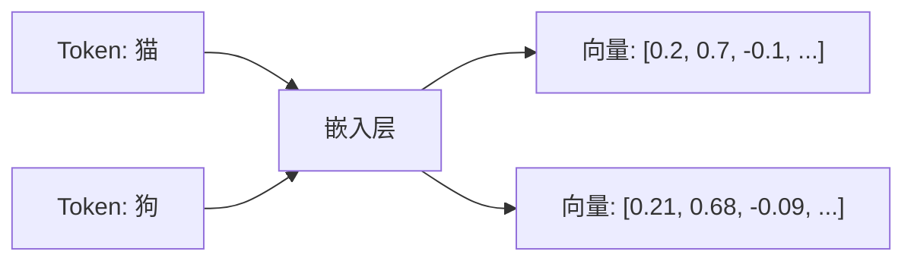
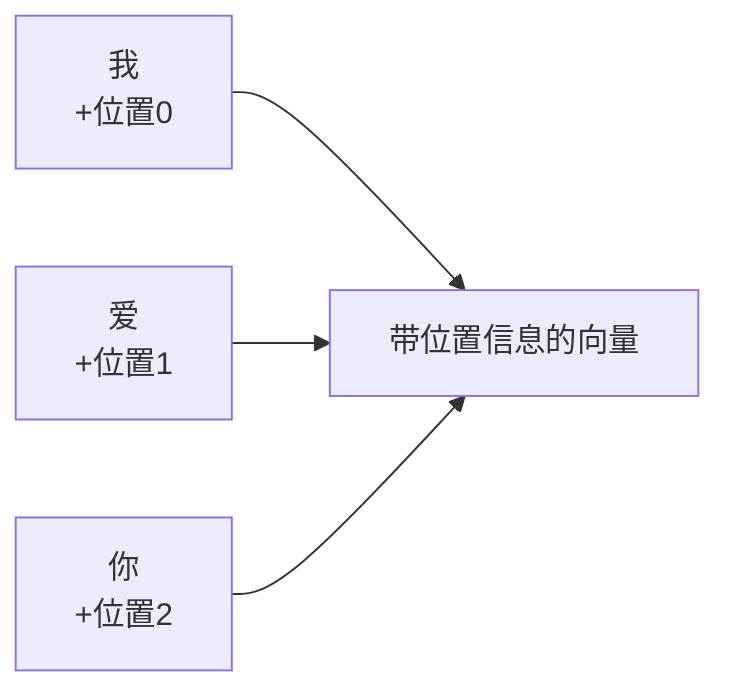
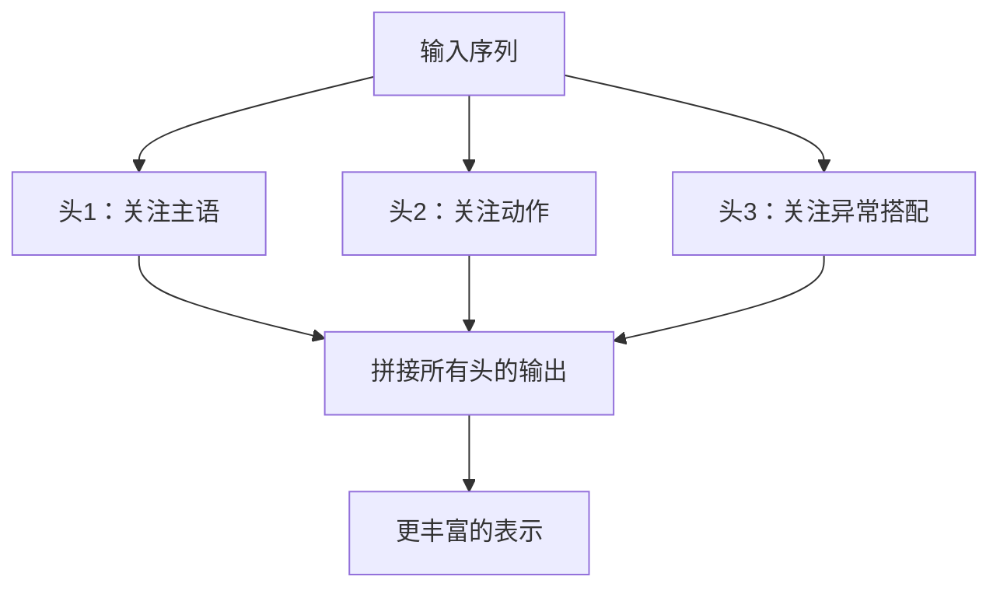
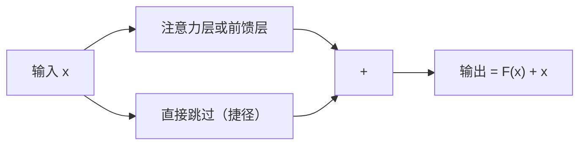
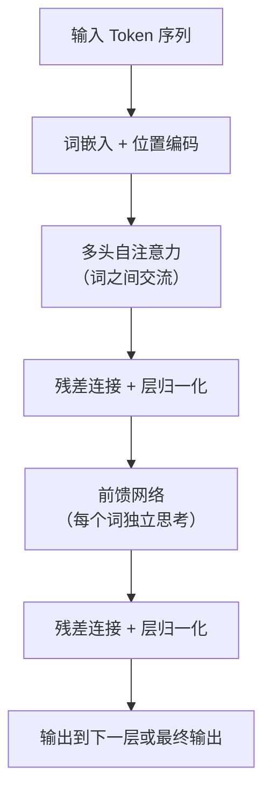
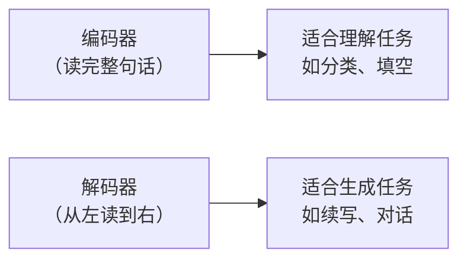

# Transformer 核心组件拆解：LLM 的“引擎盖”下面有什么？

> 上一篇文章我们讲了 LLM 的整体原理——猜下一个词。
> 这篇我们打开引擎盖，看看那个叫 **Transformer** 的东西里面到底装了哪些零件。

---

## 引言：为什么你需要知道 Transformer？

你不需要自己造一台汽车，但如果你想理解汽车为什么能跑，至少要知道：**有发动机、有轮子、有方向盘**。

同样，你不需要成为 AI 工程师，但如果你想真的搞懂 ChatGPT 为什么“聪明”，就得知道它的核心——**Transformer**——是由哪几个部件组成的。

> Transformer = 当前所有主流大模型（GPT、Claude、文心一言、Gemini）的**统一底层架构**。

它最早在 2017 年谷歌的论文《Attention Is All You Need》中提出。
名字里的“Transformer”不是变形金刚，而是“转换器”——把输入转换成输出。

下面我们用最直观的方式，逐一拆解它的 6 大核心组件。

---

## 组件 1：词嵌入（Token Embedding）—— 给每个词一张“身份证”

模型不认识文字，只认识数字。
所以第一步，要把 Token 变成一个**向量**（一串有意义的数字）。

> 嵌入 = 把一个词映射到高维空间中的一个“点”，语义相近的词，点的位置也相近。

🎯 例子（极度简化）：

```
“国王” → [0.9, 0.1, 0.8, …]
“王后” → [0.85, 0.12, 0.78, …]  ← 很接近
“苹果” → [0.2, -0.5, 0.3, …]    ← 很远
```



> 💡 一句话记忆：
> **词嵌入就是把词翻译成模型能计算的“语义坐标”。**

---

## 组件 2：位置编码（Positional Encoding）—— 告诉模型谁先谁后

Transformer 有一个“怪癖”：它看一句话时，默认所有词是**同时**进来的，没有先后顺序。

> 如果没有位置信息，`猫追狗` 和 `狗追猫` 在模型眼里是一样的。

所以必须手动给每个 Token 贴上一个**位置标签**。

### 做法

- 给第一个 Token 加上 `位置 0` 的编码
- 给第二个 Token 加上 `位置 1` 的编码
- ……

编码的方式可以是正弦/余弦函数（原始论文），也可以是可学习的参数（GPT 系列用的）。



> 💡 一句话记忆：
> **位置编码就像给扑克牌标上 1、2、3……否则牌堆就乱套了。**

---

## 组件 3：多头自注意力（Multi‑Head Self‑Attention）—— 大脑的“同时看多角度”能力

这是 Transformer **最重要**的组件，没有之一。

### 先理解“自注意力”

**自注意力** = 模型在处理某个词时，会“回头看”句子里的所有词，并计算它们跟当前词的相关程度。

> 上一篇文章的“注意力机制”说的就是它。

### 再理解“多头”

**多头** = 不只看一种相关性，而是同时从多个角度去看。

例如，同一句话：

> “他跑到银行去钓鱼。”

- **头 1** 可能关注“谁” → “他”
- **头 2** 可能关注“动作” → “跑到”
- **头 3** 可能关注“钓鱼”的特殊含义 → 需要看更远的上下文

每个头学习不同的“关注模式”，最后把结果拼在一起。



> 💡 类比：
> 单头注意力 = 你一个人看悬疑片
> 多头注意力 = 你、你的侦探朋友、你的心理医生 **同时看**，然后交换意见

---

## 组件 4：前馈网络（Feed‑Forward Network, FFN）—— 每个词“独立思考”一下

注意力机制做完后，每个 Token 已经融合了全句的信息。
接下来，每个 Token **单独**过一个小型神经网络。

> FFN  = 一个非常简单的两层全连接网络 + 激活函数（通常是 ReLU 或 GELU）。

它在做两件事：

1. **放大有用特征**：把注意力提取到的信息再加工
2. **引入非线性**：让模型能学习更复杂的模式


> 💡 一句话记忆：
> **注意力让词之间“交流”，前馈网络让每个词“自己消化”。**

---

## 组件 5：残差连接（Residual Connection）—— 一条“捷径高速公路”

深层神经网络有一个风险：层数太多，前面的信息传到最后会“失真”甚至消失。

> 残差连接 = 把输入**原封不动**地加到输出上。

公式极其简单：
`输出 = 层(输入) + 输入`



> 💡 类比：
> 就像你在公司里汇报工作，除了走正式流程，还可以给老板直接发一条微信——确保你的声音一定能被听到。

残差连接让 Transformer 可以轻松堆到几十层甚至上百层。

---

## 组件 6：层归一化（Layer Normalization）—— 让数据保持“好状态”

神经网络很“娇气”——输入数据的数值范围变化太大会导致训练不稳定。

> 层归一化 = 把每一层输出的数值**标准化**到均值为 0、方差为 1 的范围。

作用：

- 加速训练收敛
- 提高稳定性
- 减少对初始学习率的敏感度

> 💡 类比：
> 就像你在做菜时，不管食材原本多重，都按“一份 = 200 克”的标准来配比——保证每次都稳定。

---

## 一张图看懂 Transformer 的单层结构

把上面 6 个组件拼起来，就是 **Transformer 的一个“层”**。
大模型通常有几十到上百个这样的层。



---

## 编码器 vs 解码器：两种“变体”

原始 Transformer 有两大块：

| 模块             | 作用                   | 谁在用                            |
| ---------------- | ---------------------- | --------------------------------- |
| **编码器** | 一次性读完输入，理解它 | BERT、RoBERTa                     |
| **解码器** | 从左到右逐个生成输出   | **GPT 系列、Claude、LLaMA** |

现代大语言模型（像 ChatGPT）几乎都只用 **解码器**（也叫自回归 Transformer）。



> 回忆上一篇：LLM 是“自回归生成”——所以它用的是**解码器**架构。

---

## 总结：6 大组件速记表

| 组件         | 核心作用             | 一句话类比         |
| ------------ | -------------------- | ------------------ |
| 词嵌入       | 词 → 向量           | 给每个词办身份证   |
| 位置编码     | 标记顺序             | 扑克牌标序号       |
| 多头自注意力 | 词与词交互（多角度） | 多个侦探一起看线索 |
| 前馈网络     | 每个词独立加工       | 每人自己消化信息   |
| 残差连接     | 跳过层，保留原始信息 | 高速捷径           |
| 层归一化     | 稳定数值分布         | 标准化配方         |

---

## 写在最后

Transformer 的设计有一种很美的“分工感”：

- **注意力**负责沟通
- **前馈网络**负责思考
- **残差连接**负责保底
- **归一化**负责稳定

所有组件加在一起，才让“猜下一个词”这件事变得如此强大。