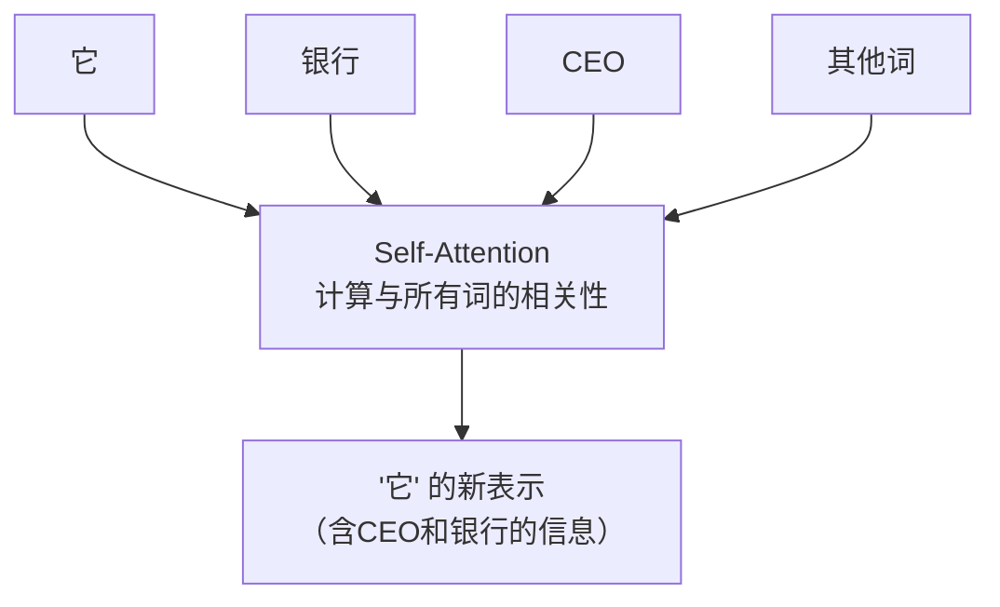
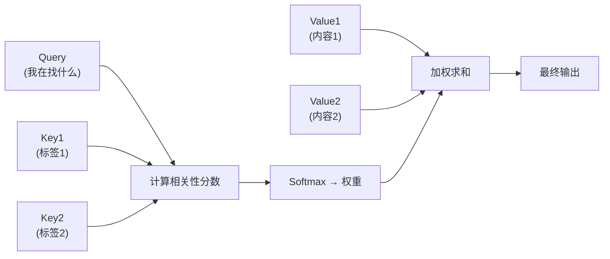
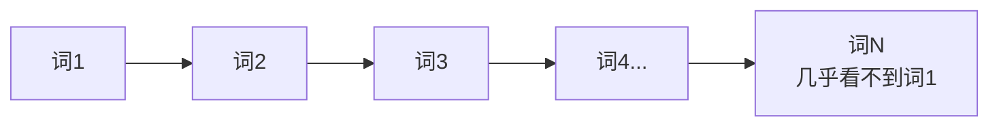
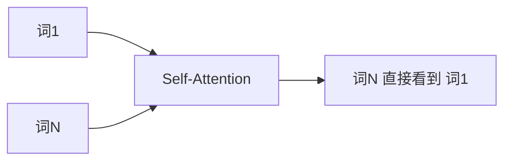
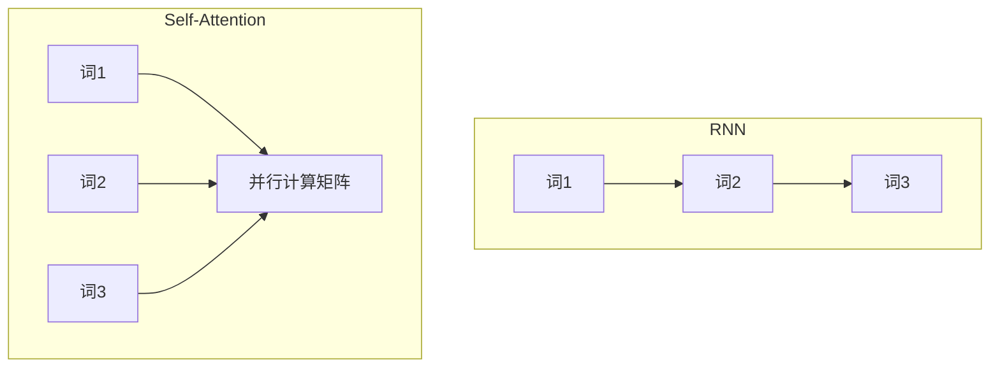
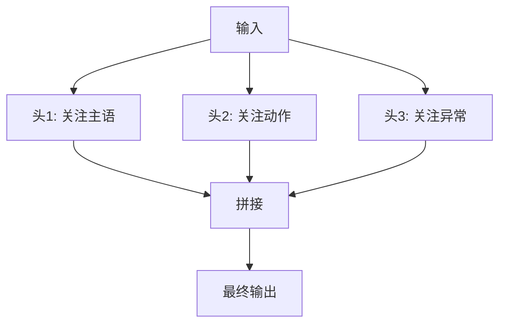
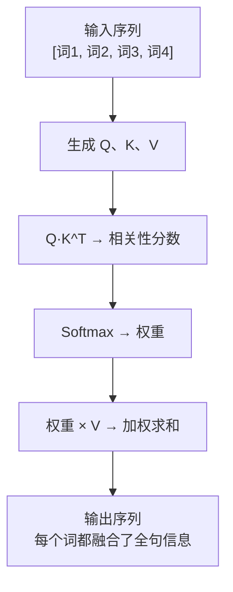

# Self-Attention：Transformer 里最聪明的那个“大脑区域”

> 如果你只想搞懂 Transformer 里的一个东西，那就搞懂 Self-Attention。
> 其他组件都可以看作是它的“助理”。

---

## 引言：一个困扰了 AI 二十年的老问题

在 Transformer 出现之前，主流的序列模型叫 **RNN（循环神经网络）**。

RNN 处理一句话的方式是：**一个词一个词地读，读完一个，脑子里留一点“记忆”，再去读下一个。**

听起来很合理，对吧？但它有两个致命的毛病：

1. **记不住太长的内容**
   读到句子末尾时，开头的内容早就“被遗忘”得差不多了（这叫“长距离依赖问题”）。
2. **只能串行计算**
   必须等第 t 个词处理完，才能处理第 t+1 个词。
   这就像你只能一个字一个字地读书，不能同时看整页——训练速度极慢。

> 2017 年，Google 的《Attention Is All You Need》提出了 **Self-Attention**，一次性解决了这两个问题。

---

## 1. 先理解“注意力”：你在看什么，重点在哪里？

你正在读这句话：

> “那个穿红衣服的小女孩在公园里追一只白色的猫。”

你的眼睛扫过去的时候，大脑并不是给每个词平均分配精力。
你会更关注：**谁**（小女孩）、**什么颜色**（红）、**做什么**（追）、**追什么**（白猫）。

> 注意力 = 在一堆信息里，**自动找出哪些部分更重要**，并给它们更高的“权重”。

Self-Attention 做的事情完全一样，只不过是在数字向量上。

---

## 2. 什么是 Self-Attention？

**Self** 的意思是：自己对自己。
Self-Attention = **序列内部的每个元素，跟序列里的所有元素（包括自己）算一遍相关性**。

还是用句子来理解：

> “它很忙，因为它是一家大银行的CEO。”

当模型读到“它”这个词时，Self-Attention 会问：

- “它” 跟 “它自己” 相关吗？（相关，但信息少）
- “它” 跟 “银行” 相关吗？（可能，要看语义）
- “它” 跟 “CEO” 相关吗？（高度相关——CEO 可能就是“它”指代的对象）

最终，“它”的输出向量里，会**融合进“CEO”和“银行”的信息**。
这样模型就“知道”了：这个“它”指的是那位 CEO。



> 核心差异：
>
> - 传统的注意力（如 RNN + Attention）：解码器看编码器
> - Self-Attention：**序列内部自己看自己**

---

## 3. Self-Attention 是怎么算的？三个角色：Q、K、V

这是初学者最容易卡住的地方，但我们用最简单的类比来讲。

你要去图书馆找一本关于“宇宙起源”的书。

| 角色                 | 数学名称       | 类比：找书                 |
| -------------------- | -------------- | -------------------------- |
| **Query（Q）** | 我关心什么     | 你想找的东西：“宇宙起源” |
| **Key（K）**   | 别人有什么标签 | 每本书的标题 / 标签        |
| **Value（V）** | 别人真正的信息 | 书的内容本身               |

**步骤：**

1. 你的 Query 去跟每个 Key 做“匹配”，算一个 **相关性分数**（比如 0.9、0.2、0.05）。
2. 这些分数经过 Softmax 变成 **权重**（总和为 1）。
3. 用这些权重去加权求和所有的 Value，得到 **最终结果**。

> 💡 核心洞察：
> **Value 是你最终要取出来的信息，Query 和 Key 只是用来决定取多少。**



在 Self-Attention 里，**Q、K、V 都来自同一个输入序列**（只是经过了不同的线性变换）。

这就是 Self 的含义：自己生成 Q，自己生成 K，自己生成 V，然后自己跟自己算注意力。

---

## 4. Self-Attention 到底解决了什么问题？

我们回头看那两个 RNN 的老问题：

### 问题 1：长距离依赖

RNN 的信息传递路径 = 沿着序列一步步传。
距离越远，信息衰减越厉害。



Self-Attention 的路径长度：**任意两个词之间都是 1 步**。



> 无论距离多远，Self-Attention 都可以让它们直接“对话”。

**例子**：

> “我 20 年前在上海认识的那个朋友，他后来去了北京，我们再也没见过，**他**现在过得怎么样？”

RNN 读到最后一个“他”时，可能已经忘了前面在说哪个朋友。
Self-Attention 可以让“他”直接跟“那个朋友”建立强连接。

---

### 问题 2：串行计算

RNN：必须一个接一个算（第 t 步依赖第 t-1 步的结果）。

Self-Attention：**所有词同时算**。
因为 Q、K、V 都可以从输入一次性得到，所有注意力分数也可以并行计算。



> 这就像：
>
> - RNN 是一列人传话
> - Self-Attention 是所有人同时接上对讲机

---

## 5. 一个完整的 Self-Attention 公式（看一眼，不用背）

数学上，Self-Attention 的计算公式是：

```
Attention(Q, K, V) = softmax(Q·K^T / √d) · V
```

解释一下：

| 符号    | 含义                                       |
| ------- | ------------------------------------------ |
| Q·K^T  | 每个 Query 与所有 Key 的点积（相关性分数） |
| √d     | 缩放因子，防止点积太大                     |
| softmax | 把分数转成概率权重                         |
| · V    | 用权重去加权求和 Value                     |

> 你看不懂公式完全没关系。
> 只要记住：**Self-Attention = 用 Q 和 K 算权重，再用权重去取 V**。

---

## 6. Multi-Head Self-Attention：多个角度同时看

有时候，一个“注意力”不够用。

同一句话，你可能想同时从多个角度去关注：

> “他跑到银行去钓鱼。”

- 头 1 关注：主语是谁 → “他”
- 头 2 关注：动作 → “跑到”
- 头 3 关注：语义异常 → “钓鱼” 和 “银行” 的非常规搭配

Multi-Head = **多组独立的 Q、K、V**，每组学习不同的“关注模式”，最后把所有头的输出拼起来。



> 💡 类比：
> 单头注意力 = 一个侦探破案
> 多头注意力 = 一个侦探 + 一个法医 + 一个心理学家一起看卷宗

---

## 7. Self-Attention 的代价：计算量变大

优点明显，缺点也很直接：

> Self-Attention 的计算复杂度是 **O(n²)**。

n 是序列长度。
句子长度翻倍，计算量翻 4 倍。

对于很长的文本（比如一本书），这非常昂贵。
这也是为什么后来出现了 **稀疏注意力**、**滑动窗口注意力** 等变体来优化。

| 长度 n | 注意力对数量 (≈ n²/2) |
| ------ | ----------------------- |
| 100    | 5,000                   |
| 1,000  | 500,000                 |
| 10,000 | 50,000,000              |

> 所以大模型的上下文窗口（比如 128K token）是一个很了不起的工程成就。

---

## 一张图总结：Self-Attention 到底做了什么



---

## 总结

> **Self-Attention 让序列里的每一个元素，都能一次性直接看到所有其他元素，并自动决定哪些更重要，从而融合进自己的表示中。**

它解决了 RNN 的：

- ❌ 长距离遗忘
- ❌ 串行计算慢

带来了新的挑战：

- ⚠️ O(n²) 计算量

---

## 写在最后

> 在 Self-Attention 出现之前，AI 读句子像一列人传话，传到最后只剩碎片。
> Self-Attention 出现之后，AI 读句子像所有人同时接上对讲机——每个人都能直接听到所有人。

这就是为什么 Self-Attention 被称为 **Transformer 的“核心大脑”**。