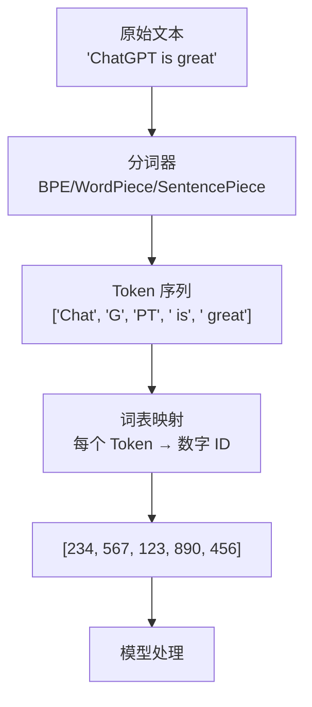

# 为什么需要分词？BPE、WordPiece、SentencePiece 详解

> 模型不认识字母，只认识数字。但在把文字变成数字之前，还有一个容易被忽略却极其关键的步骤——**分词**。

---

## 引言：一个被咬了一口的苹果

想象一下：

我递给你一个完整的苹果，你可以直接吃。
但如果我递给你的是**已经切成块的苹果**，你只需要拿起一块放嘴里就行了——更省事。

LLM 处理文本也是这样：

- 原始文本 = 整个苹果
- 分词 = 切成一口大小的块
- 每个块 = 一个 Token

> **分词就是把原始文本切分成模型能处理的“基本单元”。**

这看起来很简单，但里面藏着很多精妙的设计。
为什么不能直接用“字”或“词”呢？BPE、WordPiece、SentencePiece 又是什么？

这篇文章帮你彻底搞清楚。

---

## 1. 为什么不能直接用“字”？

最直观的想法：把每个汉字当成一个 Token。

中文：“我爱吃苹果” → `[我]` `[爱]` `[吃]` `[苹]` `[果]`

但这有问题：

- **信息太碎**：`苹` 单独出现几乎没意义
- **词表太小**：汉字只有约 9000 个常用字，但中文词汇量巨大
- **丢失语义**：`苹果` 是一个完整概念，拆成 `苹` + `果` 就丢了

---

## 2. 为什么不能直接用“词”？

那直接用词典里的词呢？

“我爱吃苹果” → `[我]` `[爱]` `[吃]` `[苹果]`

看起来不错。但有个致命问题：**词太多了**。

- 英语有几十万到上百万个词
- 中文词语更是无限（复合词、新词层出不穷）

如果每个词都占一个 ID：

| 问题        | 后果                                             |
| ----------- | ------------------------------------------------ |
| 词表太大    | 模型最后一层（输出概率）计算量爆炸               |
| 生僻词/新词 | 找不到对应的 ID → 直接报错                      |
| 形态变化    | `run` / `running` / `runs` 都需要不同的 ID |

> 词表太小会丢失信息，词表太大会算不动。
> 我们需要一个**平衡方案**：介于“字”和“词”之间。

---

## 3. 子词分词（Subword Tokenization）——黄金中间态

**核心思想**：

> 高频词保留为完整 Token，低频词拆成常见的“子词片段”。

✅ 常用词 `the`、`苹果` → 完整 Token
✅ 生僻词 `unhappiness` → `un` + `happiness`
✅ 未知词 `ChatGPT` → `Chat` + `G` + `P` + `T`（或更细）

好处：

- 词表可控（通常 3 万 ~ 10 万）
- 没有“未登录词”——任何词都能用子词拼出来
- 语义保留：`un` 表示否定，`happiness` 是快乐

---

## 4. BPE（Byte Pair Encoding）——最经典的方法

**BPE 的发明背景**：
最早是 1994 年用于数据压缩的算法，后来被 GPT-2 / GPT-3 采用。

### 工作原理（一步步）

1. 把所有词拆成**字符级别**：
   `apple` → `a p p l e`
2. 统计最常出现的相邻字符对：
   `p` 和 `p` 经常一起出现 → 合并成 `pp`
3. 重复合并，直到达到预设的**词表大小**


### BPE 的特点

- ✅ 简单、高效
- ✅ 适合英语等用空格分詞的语言
- ⚠️ 基于空格分词，对中文不友好（中文没有天然空格）

---

## 5. WordPiece——Google 的选择

**WordPiece** 是 Google 为 BERT 设计的，与 BPE 非常相似，但有一个关键区别。

| 对比项   | BPE                             | WordPiece                      |
| -------- | ------------------------------- | ------------------------------ |
| 合并规则 | 选**频率最高**的相邻对    | 选**使似然提升最大**的对 |
| 似然计算 | 无                              | 合并后让训练数据的概率更高     |
| 特殊标记 | `##` 表示子词（如 `##ing`） | `##` 同样用法                |

### 直观差异

BPE 合并“最常见的”。
WordPiece 合并“最有信息增益的”。

> 类比：
> BPE = 采访 100 个人，选最常见的回答
> WordPiece = 采访 100 个人，选最能**减少不确定性**的回答

WordPiece 在 BERT、DistilBERT 中使用。

---

## 6. SentencePiece——统一中英文的利器

前面两种方法都有一个假设：**文本里有空格**。
这对英语没问题，但对**中文、日文、韩文**就很尴尬——它们没有空格。

**SentencePiece** 的解决方案：

> 把空格也当成一个普通字符（`_`），和其他字符一起编码。

### SentencePiece 的特点

- ✅ 不依赖空格，可以直接处理中文
- ✅ 可以从原始文本直接学习子词
- ✅ 支持 BPE 和 unigram 两种算法
- ✅ 训练好之后，**编码和解码完全可逆**


> 注意：`_` 表示一个词的开头

### 谁在用 SentencePiece？

- **LLaMA**（Meta）
- **Gemma**（Google）
- **XLM-RoBERTa**（Facebook）

几乎所有现代多语言大模型都使用 SentencePiece。

---

## 7. 三种方法对比表

| 维度          | BPE               | WordPiece    | SentencePiece  |
| ------------- | ----------------- | ------------ | -------------- |
| 提出者        | OpenAI / 数据压缩 | Google       | Google         |
| 合并/选择规则 | 最高频            | 最大似然增益 | BPE 或 unigram |
| 依赖空格      | 需要              | 需要         | 不需要         |
| 中文支持      | 较弱              | 较弱         | ✅ 好          |
| 可逆性        | 一般              | 一般         | ✅ 完全可逆    |
| 典型使用者    | GPT, RoBERTa      | BERT         | LLaMA, Gemma   |

---

## 8. 一个完整的例子：同一句话的不同分词

原句：`"ChatGPT is great!"`

### BPE（GPT-4）

```
["Chat", "G", "PT", " is", " great", "!"]
```

### WordPiece（BERT）

```
["Chat", "##GP", "##T", "is", "great", "!"]
```

### SentencePiece（LLaMA）

```
["▁Chat", "G", "PT", "▁is", "▁great", "!"]
```

> `▁` 是 SentencePiece 表示空格的符号

你会发现：同一个词可能在不同方法下被切成不同的子词序列。

---

## 9. 为什么分词很重要？三个核心原因

### 原因 1：平衡词表大小与覆盖率

- 纯字符：词表太小（~200），但序列太长
- 纯词：词表太大（>50 万），且会漏词
- 子词：两者之间最优

### 原因 2：处理未知词（OOV）

模型在训练时没见过 `Transformerology` 这个词。
但通过 BPE 可以拆成 `Transformer` + `ology` → 模型认识！

### 原因 3：影响模型性能

分词质量直接影响：

| 影响方面   | 说明                                     |
| ---------- | ---------------------------------------- |
| 语义保留   | `un` 和 `happiness` 分开仍有意义     |
| 计算效率   | 太细的分词让序列变长，注意力 O(n²) 更贵 |
| 多语言能力 | SentencePiece 才能良好处理非空格语言     |

---

## 10. 一张图总结：从文本到 Token 的完整流程



---

## 写在最后

分词看起来是个“预处理”小步骤，但它决定了：

- 模型能“看到”什么
- 模型训练有多快
- 模型能否支持多种语言
- 模型能否处理没见过的新词

> **一个好的分词器，是 LLM 的第一道门槛。**

| 场景            | 推荐            |
| ------------- | ------------- |
| 英语为主（GPT）     | BPE           |
| 多语言/中文（LLaMA） | SentencePiece |
| 经典 BERT       | WordPiece     |