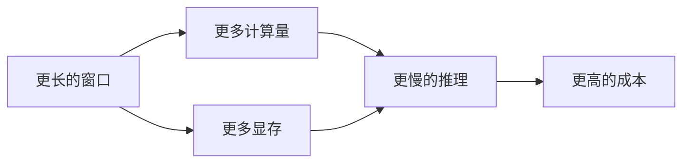
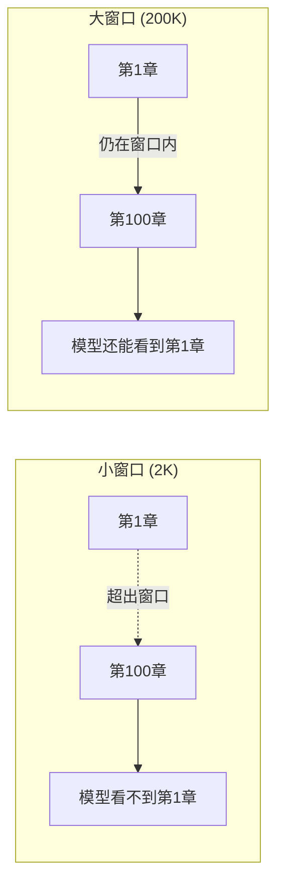
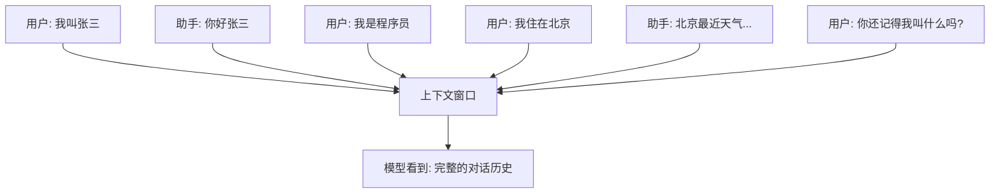
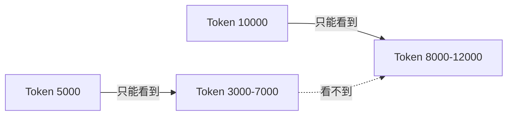
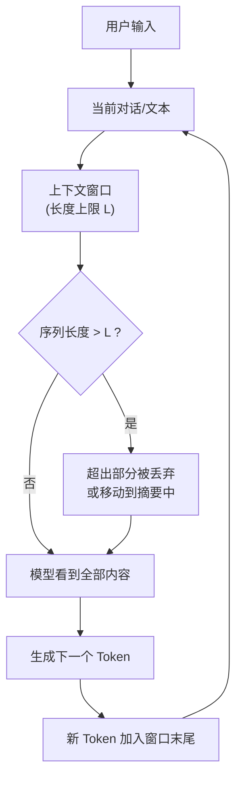

# 什么是上下文窗口？LLM 的“工作记忆”有多大？

> 你一次能记住多少句话？10 句？50 句？还是一整本书？
> 对 LLM 来说，这个上限就叫**上下文窗口**。

---

## 引言：一个“健忘”的天才

大语言模型能写诗、能编程、能陪你聊天。

但它有一个你意想不到的弱点：**它是健忘的**。

不是那种“过了三天就忘”的健忘，而是**过了某个长度就彻底看不见**的那种健忘。

> 上下文窗口 = 模型一次能“看到”的最大 Token 数量。
> 超出这个窗口的内容，模型就像从来没读过一样——完全消失。

举个例子：

```
你：我叫张三，我是个程序员。
（中间聊了 100 页别的）
你：你还记得我叫什么吗？
```

如果模型的上文窗口只有 50 页，它早就忘了。
你敢让它写小说、总结长篇报告吗？——可能它写到后面，已经忘了开头写了什么。

---

## 1. 为什么会有上下文窗口？

不是为了“故意健忘”，而是因为**技术限制**。

### 原因 1：Self-Attention 的计算复杂度是 O(n²)

还记得上一篇 Self-Attention 吗？

> 每个词要跟所有其他词算一遍相关性。
> 上下文长度 n 翻倍 → 计算量翻 4 倍。

| 上下文长度  | 注意力计算对数量（≈ n²/2） |
| ----------- | ---------------------------- |
| 1K tokens   | 50 万                        |
| 10K tokens  | 5000 万                      |
| 100K tokens | 50 亿                        |

> 窗口越长，计算成本爆炸式增长。

### 原因 2：内存和显存限制

每个 Token 都要在 GPU 显存中保存它的向量表示。
窗口 100K → 仅存储 Key/Value 就需要几十 GB 显存。



所以所有 LLM 都有一个**硬上限**——不是不想记，是算不起。

---

## 2. 不同模型的上下文窗口对比

窗口大小在过去两年增长极快：

| 模型           | 上下文窗口            | 发布年份 |
| -------------- | --------------------- | -------- |
| GPT-3          | 4K (~3000 个汉字)     | 2020     |
| LLaMA 1        | 2K                    | 2023     |
| GPT-3.5        | 4K → 16K             | 2023     |
| GPT-4          | 8K → 32K → 128K     | 2023     |
| Claude 2       | 100K                  | 2023     |
| Claude 3       | 200K                  | 2024     |
| Gemini 1.5 Pro | **1M (100 万)** | 2024     |
| LLaMA 3        | 8K → 128K            | 2024     |

> 1M Token 是什么概念？
> 《三体》三部曲总共约 80 万字 ≈ 100 万 Token。
> 你可以把整部《三体》一次性喂给模型，然后问它“罗辑在哪一章提出的黑暗森林理论？”

---

## 3. 两万米 vs 两百米：用跑步来理解窗口

想象你要跑一段路，路上有各种提示牌：

- **小窗口 (2K)**：只能看到眼前 200 米。跑马拉松时，你完全忘了 10 公里前的路况。
- **大窗口 (200K)**：能看到前方 20 公里。你能规划路线、记住关键信息。



> 窗口越大，模型越能“从头到尾”理解长文本。

---

## 4. 上下文窗口里面到底有什么？

窗口里装的是 **Token 序列**——从第一句话到当前位置的所有内容。



> 注意：窗口包括**用户输入 + 模型输出 + 系统提示词**。
> 所以长对话会不断“吃掉”窗口空间。

### 一个容易被忽略的点

> 你给模型的那一大段文本（比如 5000 字的 PDF），模型的回复也会**加入窗口**。
> 如果对话太长，最初的 PDF 内容可能会被**挤出窗口**。

这就是为什么长对话后，模型会“忘记”你最开始给它的文档。

---

## 5. 窗口满了怎么办？——三种常见的处理方式

### 方式 1：直接截断（最粗暴）

> 只保留窗口末尾的最新 Token，前面的全部丢掉。

**优点**：简单
**缺点**：丢失关键信息

### 方式 2：滑动窗口注意力

> 每个 Token 只关注它附近的 Token（比如前后 4K），而不是整个 128K。

**优点**：计算量可控
**缺点**：两端的 Token 无法直接交互



### 方式 3：摘要 + 重写（最智能）

> 把窗口里的旧内容**压缩成摘要**，然后继续对话。

ChatGPT 的“长对话记忆”功能就是这样：


---

## 6. 上下文窗口不是越大越好——三个代价

1. **推理延迟变高**
   窗口越大，生成每个 Token 时看的 Token 越多，速度越慢。
2. **成本更高**
   很多 API 按输入 Token 数收费。100K 的输入比 10K 贵 10 倍。
3. **“中间遗忘”现象**
   OpenAI 的研究发现：即使窗口能装下全文，模型对**中间部分**的 recall 准确率远低于开头和结尾。


> 有趣的发现：
> 模型像人类一样，对一段话的**开头和结尾印象更深**，中间容易忽略。

---

## 7. 不同场景需要的窗口大小

| 场景            | 建议窗口 | 说明                     |
| --------------- | -------- | ------------------------ |
| 日常聊天        | 8K       | 正常人对话不会超过几千字 |
| RAG（检索增强） | 4K~8K    | 检索出的片段 + 用户问题  |
| 代码生成        | 16K+     | 需要看到整个文件         |
| 长文档摘要      | 100K+    | 一次性读完整篇论文/报告  |
| 长篇小说分析    | 200K+    | 《三体》级别             |
| 多轮复杂对话    | 16K~32K  | 开发 Agent 时需要历史    |

---

## 8. 一张图总结：上下文窗口是什么



---

## 9. 实用建议：如何用好模型的窗口？

### 对普通用户

- 长文档：尽量放在**对话最开始**，而不是聊到一半再塞进去
- 重要信息：在提问时**重复一遍**（比如“按照我开头给你的那个 PDF……”）
- 分治法：把超长文档拆成多段，分别问

### 对开发者

- 分段 + 滑动：用 LangChain 的 `MapReduce` / `Refine` 模式
- 优先用 RAG 而不是塞满整个窗口
- 监控 Token 使用量（`tiktoken` 库可以帮你数）

---

## 写在最后

上下文窗口本质上是**效率与能力之间的权衡**：

> 更大的窗口 = 更强的长文本理解能力 + 更高的计算成本 + 更慢的速度

也许不久的将来，“窗口”这个概念会消失——
那时候的模型，可能真的能**记住和你聊过的每一句话**。