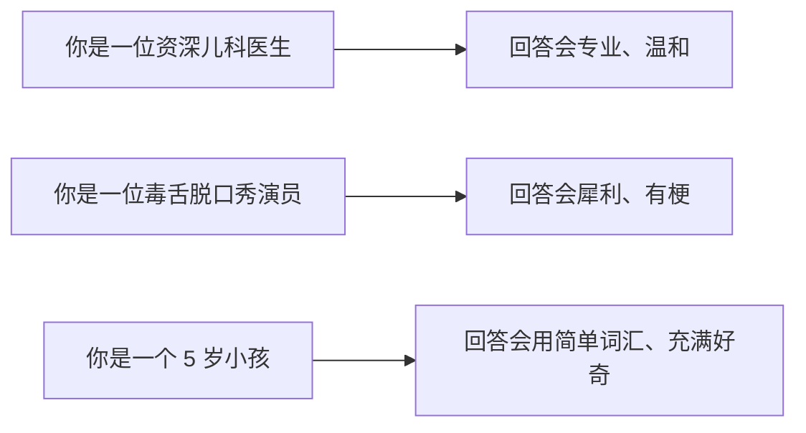
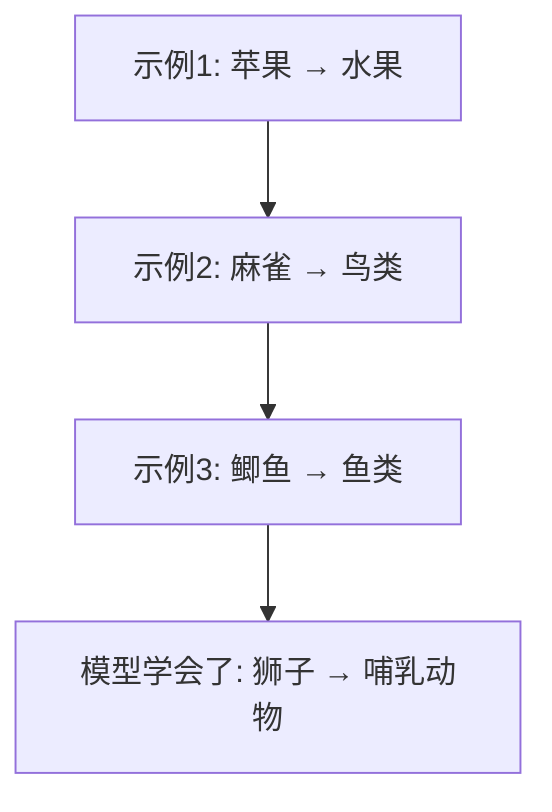
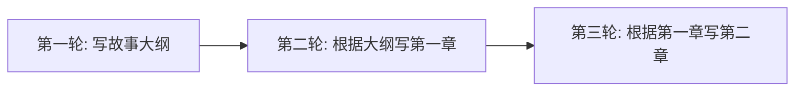
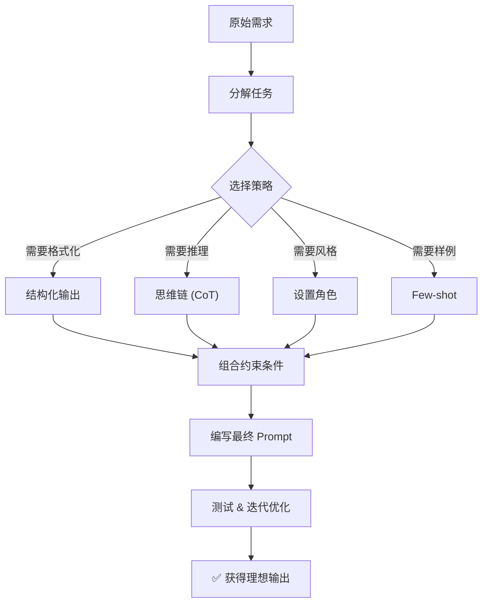

# Prompt Engineering：如何让 LLM 说出你真正想要的话

> 模型还是那个模型，但问法不同，答案天差地别。
> 这就是 **Prompt Engineering**——学会和大语言模型“好好说话”。

---

## 引言：同样是问路，结果不同

你问路人：“怎么去车站？”
对方可能随手一指：“那边。”

你换一种问法：“你好，请问去火车南站怎么走？我走路，大概要走多久？”
对方会停下来，认真给你指路，还提醒你哪个路口有红绿灯。

> **LLM 也是这样。**
> 你给的提示词（Prompt）越清晰，它的回答就越有用。

Prompt Engineering 不是“编程”，而是**设计输入**，让模型按照你想要的方式输出。

---

## 1. 为什么需要 Prompt Engineering？

LLM 的训练目标是“预测下一个词”，不是“理解你的真实意图”。

模型会猜，但猜的不一定是你想要的：

| 你问                     | 模型可能猜                                    |
| ------------------------ | --------------------------------------------- |
| “写一篇关于环保的文章” | 2000 字学术论文？还是 50 字口号？             |
| “帮我总结一下”         | 总结成一句话？三个要点？还是带小标题？        |
| “这个代码有问题吗？”   | 只说“有”，还是逐行指出问题 + 给出修改建议？ |

> **Prompt Engineering = 消除歧义，缩小模型的“猜测空间”。**

---

## 2. 八大核心策略（附场景与示例）

### 策略 1：清晰明确的指令

**核心**：直接告诉模型要做什么，不要让它猜。

**不推荐**：

> “写点关于机器学习的。”

**推荐**：

> “用 50 个字以内，向一个初中生解释什么是机器学习。”

**适用场景**：✅ 所有场景的“第一原则”

---

### 策略 2：设置角色（System Prompt / Persona）

**核心**：给模型一个“身份”，它会自动调整语气和知识范围。



**示例**：

> “你是一位资深财务顾问，用通俗易懂的语言解释什么是通货膨胀，并举例说明它对普通人的影响。”

**适用场景**：✅ 客服机器人 ✅ 角色扮演 ✅ 风格化写作

---

### 策略 3：提供示例（Few-shot Prompting）

**核心**：给 1~3 个例子，模型就能跟着“照葫芦画瓢”。



**示例**：

```
将以下产品名称分类为【电子产品】、【家居用品】、【服装】：

洗衣机 → 家居用品
iPhone → 电子产品
羊毛大衣 → 服装
空气炸锅 → ？
```

**适用场景**：✅ 分类 ✅ 信息抽取 ✅ 格式转换 ✅ 需要输出特定结构的任务

---

### 策略 4：结构化输出（JSON / Markdown / 列表）

**核心**：明确指定输出格式，方便程序解析。

**示例**：

> “从以下文本中提取：患者姓名、年龄、诊断结果，以 JSON 格式输出：
> {"patient_name": "", "age": 0, "diagnosis": ""}”

**适用场景**：✅ API 集成 ✅ 自动化处理 ✅ 数据标注

---

### 策略 5：思维链（Chain-of-Thought, CoT）

**核心**：让模型**一步一步想**，而不是直接蹦答案。

**不推荐**（直接问）：

> “Roger 有 5 个网球，他买了 2 罐网球，每罐有 3 个网球，他现在有多少个？”

模型可能答错。

**推荐**（加一句“让我们一步步思考”）：

> “Roger 开始有 5 个网球。
> 2 罐网球，每罐 3 个，共 2 × 3 = 6 个。
> 5 + 6 = 11。
> 答案是 11。”


**适用场景**：✅ 数学推理 ✅ 逻辑题 ✅ 多跳问答 ✅ 需要解释的任务

---

### 策略 6：自我一致性（Self-Consistency）

**核心**：让模型**多次回答同一个问题**，然后投票选出现次数最多的答案。

> 这是思维链的增强版。

**示例流程**：

```
Q: “某商店打 8 折后再减 20 元，最终价格是 100 元，原价是多少？”

生成 3 次带思维链的回答：
- 回答1：150 元
- 回答2：150 元  
- 回答3：135 元（可能算错了）

最终答案：150 元（2 票胜出）
```

**适用场景**：✅ 数学 ✅ 有确定答案的推理题 ✅ 敏感决策（增加置信度）

---

### 策略 7：要求模型承认不确定性

**核心**：告诉模型“不知道就说不知道”，减少胡编乱造（幻觉）。

**不推荐**：

> “世界上最冷的地方是哪里？”

模型可能会编一个。

**推荐**：

> “如果你确定，就回答；如果不确定，请说‘我不知道’。世界上最冷的地方是哪里？”

**适用场景**：✅ 需要高准确率的场景 ✅ 知识问答 ✅ 医疗/法律等严肃领域

---

### 策略 8：分隔符与结构化 Prompt

**核心**：用 `###`、`---`、`"""`、`<tag>` 等符号分隔不同部分，防止混淆。

**示例**：

```
### 系统指令 ###
你是一个文本校对助手，只修正错别字，不改变原意。

### 用户输入 ###
这篇文章写的很好，但有个别错别字。

### 需要校对的文本 ###
人工智能正在改变世界，它能够处理大量讯息。
```

**适用场景**：✅ 复杂多轮 Prompt ✅ 系统指令 + 用户输入分离

---

## 3. 策略选择速查表

| 策略         | 一句话总结       | 最佳场景     |
| ------------ | ---------------- | ------------ |
| 清晰指令     | 直接说要什么     | 所有场景     |
| 设置角色     | 给模型一个身份   | 风格化对话   |
| Few-shot     | 给例子照抄       | 分类、抽取   |
| 结构化输出   | 指定格式         | API 对接     |
| 思维链 (CoT) | 一步步想         | 数学、推理   |
| 自我一致性   | 多次回答取多数   | 高置信度推理 |
| 承认不确定   | 不知道就说不知道 | 防幻觉       |
| 分隔符       | 用符号分区       | 复杂 Prompt  |

---

## 4. 一个完整案例：从“差”到“好”的演变

### 差 Prompt

> “写一篇关于健康的文章。”

模型输出：一段泛泛而谈、50~5000 字不等的随机内容。

---

### 好 Prompt

> “你是一位营养学专家。请写一篇 300 字的短文，向上班族解释‘为什么早餐很重要’，包含以下三个要点：血糖稳定、代谢提升、注意力改善。用第二人称‘你’来写，语气亲和，不要用专业术语。”

模型输出：一篇 300 字、结构清晰、语气亲切的科普短文。

---

### 差距在哪里？

| 维度      | 差 Prompt | 好 Prompt      |
| --------- | --------- | -------------- |
| 角色      | 无        | 营养学专家     |
| 长度      | 无        | 300 字         |
| 受众      | 无        | 上班族         |
| 核心要点  | 无        | 3 个明确要点   |
| 语气/人称 | 无        | 第二人称、亲和 |
| 限制条件  | 无        | 不用专业术语   |

> **每多给一个约束，模型的“猜测空间”就缩小一圈，答案就更接近你的预期。**

---

## 5. 进阶技巧

### 技巧 1：把复杂任务拆成多步

不要指望一步到位：

```
❌ “读这篇 10000 字的文档，然后写摘要、提取关键词、分析情感。”

✅ 步骤1：写 500 字摘要
✅ 步骤2：提取 10 个关键词
✅ 步骤3：判断整体情感倾向（正面/中性/负面）
```

### 技巧 2：使用“提示链”（Prompt Chaining）

上一个 Prompt 的输出作为下一个 Prompt 的输入：



### 技巧 3：添加“负向约束”

告诉模型**不要**做什么：

> “不要使用‘首先、其次、最后’这类连接词”
> “不要在第一段就给出结论”
> “不要出现任何专业术语”

---

## 6. 不同模型对 Prompt 的敏感度

| 模型类型            | 特点               | Prompt 策略                   |
| ------------------- | ------------------ | ----------------------------- |
| 早期 GPT-3          | 较“笨”，容易跑偏 | 需要 Few-shot + 极清晰的指令  |
| GPT-4 / Claude 3    | 理解力强           | 自然语言指令通常就够          |
| 开源模型（LLaMA 3） | 中等敏感度         | 建议加角色 + 示例             |
| 小型模型（7B 以下） | 较脆弱             | 尽量用 Few-shot，避免复杂推理 |

> 经验法则：**模型越小、越老，越需要详细的 Few-shot 示例。**

---

## 7. 一张图总结：Prompt Engineering 核心流程



---

## 写在最后

Prompt Engineering 的本质不是“魔法”，而是**沟通技巧**：

> 你想要什么、你希望以什么形式拿到、你有什么限制——把这些**明确告诉模型**。

很多时候，不是你用的模型不够强，而是你的 Prompt 给得不够好。

下次试试这个模板：

```
【角色】你是一位 [xxx]
【任务】请 [具体动作]
【要求】1. xxx  2. xxx  3. xxx
【格式】输出格式为 [JSON / Markdown / 列表]
【约束】不要 xxx，如果不知道请说“不知道”
```