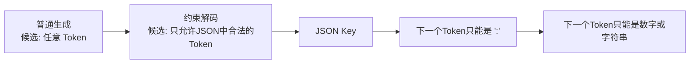
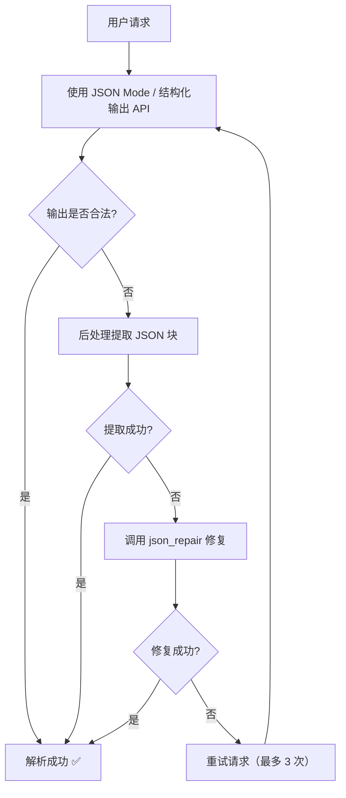

# 让 LLM “按格式输出”更稳定：从随缘到可控的工程实战

> “我让它输出 JSON，它给我回了带 Markdown 格式的 JSON，有时候还加一句‘如上所示’……”
> 这是每个 LLM 开发者都遇到过的“血压升高”时刻。

---

## 引言：格式不稳定的痛

你调用 API 时希望拿到这样的输出：

```json
{"name": "张三", "age": 28, "city": "北京"}
```

但模型却返回：

````
如上所示，用户的信息如下：

```json
{
  "name": "张三",
  "age": 28,
  "city": "北京"
}
```

希望能帮到你！
````

你的 JSON 解析器直接报错。😤

> **让 LLM 稳定输出结构化格式，不是“写个 Prompt 让它尽量遵守”就能解决的。**
> 它需要一套组合拳——Prompt 技巧 + 约束解码 + 后处理校验。

本文从**简单到可靠**，逐步介绍 6 种工程手段。

---

## 1. 纯 Prompt 手段（最轻量，但不够稳定）

### 策略 1：极简指令 + 示例

```python
prompt = """
提取以下文本中的信息，输出 JSON 格式，不要有其他无关内容。

文本：张三今年28岁，住在北京。

输出：
{"name": "张三", "age": 28, "city": "北京"}
"""
```

### 策略 2：明确禁止额外内容

```
输出格式：纯 JSON 对象，不要有解释、不要有 Markdown 代码块标记、不要有其他文字。
```

### 策略 3：用分隔符锁定输出区域

```
### 输出开始（下一行开始必须是 JSON）###
[模型输出]
### 输出结束 ###
```

**问题**：纯 Prompt 手段在 70%~85% 的情况下有效，但总会有“不听话”的时候。
尤其当模型不确定时，更容易“多说话”。

---

## 2. 约束解码（Constrained Decoding）—— 最可靠的工程方案

这是目前**最稳定**的方法：在模型生成 Token 时，就限制它只能输出符合某种格式的内容。

### 2.1 JSON Mode（OpenAI / Anthropic 原生支持）

OpenAI 的 `response_format` 参数：

```python
from openai import OpenAI
client = OpenAI()

response = client.chat.completions.create(
    model="gpt-4o-2024-08-06",
    messages=[
        {"role": "system", "content": "提取信息，输出 JSON 对象。"},
        {"role": "user", "content": "张三，28岁，北京"}
    ],
    response_format={"type": "json_object"}  # 👈 关键
)
```

**效果**：模型**只会输出合法的 JSON**，不会有多余文字。

Anthropic Claude 的类似功能：

```python
response = client.messages.create(
    model="claude-3-haiku-20240307",
    system="输出 JSON 格式。",
    messages=[...],
    extra_headers={"anthropic-beta": "json-mode-2024-07-25"}
)
```

### 2.2 结构化输出（Structured Outputs）—— OpenAI 最新方案

直接提供 JSON Schema，模型严格按照 Schema 输出：

```python
response = client.beta.chat.completions.parse(
    model="gpt-4o-2024-08-06",
    messages=[...],
    response_format={
        "type": "json_schema",
        "json_schema": {
            "name": "person_info",
            "schema": {
                "type": "object",
                "properties": {
                    "name": {"type": "string"},
                    "age": {"type": "integer"},
                    "city": {"type": "string"}
                },
                "required": ["name", "age", "city"]
            }
        }
    }
)
```

**优点**：

- ✅ 100% 符合 Schema
- ✅ 字段类型自动校验（age 一定是 int，不是 "28"）
- ✅ 必填字段保证存在

### 2.3 开源替代：Outlines / Guidance / LMQL

如果你使用开源模型（LLaMA、Mistral），可以用这些库实现约束解码：

```python
# Outlines 示例
import outlines

model = outlines.models.transformers("mistralai/Mistral-7B")
generator = outlines.generate.json(model, Person)

result = generator("张三，28岁，北京")
# 输出: {"name": "张三", "age": 28, "city": "北京"}
```

**原理**：在生成时，用正则 / 上下文无关文法约束下一个 Token 的候选集。



---

## 3. 后处理：兜底方案

即使加了约束解码，有些场景（如用户直接调用通用模型）仍需要后处理。

### 3.1 提取 JSON 块

```python
import re
import json

def extract_json(text):
    # 尝试匹配 ```json ... ``` 中的内容
    pattern = r"```json\s*(\{.*?\})\s*```"
    match = re.search(pattern, text, re.DOTALL)
    if match:
        return json.loads(match.group(1))
  
    # 尝试直接找第一个 { 到最后一个 }
    start = text.find("{")
    end = text.rfind("}")
    if start != -1 and end != -1:
        return json.loads(text[start:end+1])
  
    raise ValueError("No JSON found")
```

### 3.2 解析“修复”非标准 JSON

有些模型会输出：

- 尾随逗号：`{"name": "张三",}`
- 单引号：`{'name': '张三'}`
- 缺少引号：`{name: "张三"}`

可以用 `jsonlines`、`demjson` 或 `json_repair` 库：

```python
import json_repair

repaired = json_repair.repair_json(broken_json_string)
data = json.loads(repaired)
```

### 3.3 重试机制

```python
def call_with_retry(prompt, max_retries=3):
    for i in range(max_retries):
        response = model.generate(prompt)
        try:
            return json.loads(response)
        except json.JSONDecodeError:
            if i == max_retries - 1:
                raise
            # 追加一条指令要求重新输出 JSON
            prompt += "\n之前的输出不是合法 JSON，请只输出 JSON。"
    return None
```

---

## 4. 输出非 JSON：YAML / 表格 / Markdown

### 4.1 YAML 输出

YAML 比 JSON 更“人性化”，但解析稍复杂。

**Prompt 示例**：

```
以 YAML 格式输出，不要有任何额外文字：
---
name: 张三
age: 28
city: 北京
```

**解析**：

```python
import yaml

data = yaml.safe_load(response)
```

**稳定性技巧**：要求用 `---` 包裹，便于截取。

### 4.2 Markdown 表格

模型输出表格很稳定，因为它是自然语言的一部分。

**Prompt**：

```
输出为 Markdown 表格，三列：姓名、年龄、城市。
| 姓名 | 年龄 | 城市 |
|------|------|------|
| 张三 | 28   | 北京 |
```

**解析**：可直接保留给前端渲染，或用 `pandas.read_html()` 解析。

### 4.3 CSV / TSV

适合大量数据的批量输出。

**Prompt**：

```
输出 CSV 格式（逗号分隔，不要表头）：
张三,28,北京
李四,32,上海
```

---

## 5. 对比表：各方案选择指南

| 方案                 | 稳定性          | 实现成本 | 适用场景              |
| -------------------- | --------------- | -------- | --------------------- |
| 纯 Prompt 指令       | ⭐⭐ 60%~80%    | 极低     | 原型、非关键路径      |
| JSON Mode（API）     | ⭐⭐⭐⭐ 99%    | 低       | 使用 OpenAI/Claude    |
| 结构化输出（Schema） | ⭐⭐⭐⭐⭐ 100% | 低       | 需要类型校验的场景    |
| 约束解码（开源自建） | ⭐⭐⭐⭐⭐ 100% | 高       | 自部署模型 / 离线环境 |
| 后处理 + 重试        | ⭐⭐⭐ 80%~95%  | 中       | 通用模型的兜底        |
| 换用 YAML/表格       | ⭐⭐⭐⭐ 95%    | 低       | 可接受非 JSON 的场景  |

---

## 6. 端到端最佳实践：一个推荐架构



### 核心原则

> **优先用 API 级别的约束解码，后处理是兜底，重试是最后防线。**

---

## 7. 常见错误与解决

| 错误现象                      | 原因                   | 解决方案                  |
| ----------------------------- | ---------------------- | ------------------------- |
| 输出多了 “Here's your JSON” | 模型习惯性解释         | 用 JSON Mode / 结构化输出 |
| JSON 结尾有尾随逗号           | 某些开源模型行为       | 后处理用 json_repair      |
| age 输出成 "28" 字符串        | Schema 未定义类型      | 用结构化输出强制 integer  |
| 多层嵌套 JSON 出错            | 复杂 Schema 模型难遵守 | 拆成多次调用              |
| 表格列数对不齐                | 模型算错               | 在示例中给出完整表格      |

---

## 8. 总结：三种层次，按需选择

| 层次               | 方法                            | 什么时候用                   |
| ------------------ | ------------------------------- | ---------------------------- |
| **L1：轻量** | 写好 Prompt + 后处理提取        | 个人项目、小流量、非关键     |
| **L2：靠谱** | JSON Mode / 结构化输出（API）   | 生产环境、使用 OpenAI/Claude |
| **L3：极致** | 约束解码库（Outlines/Guidance） | 自部署模型、强合规要求       |

> 最终建议：**能用 L2 就用 L2**，不要把时间花在“写更复杂的 Prompt 逼它输出 JSON”上。
> 工具已经帮你解决了。