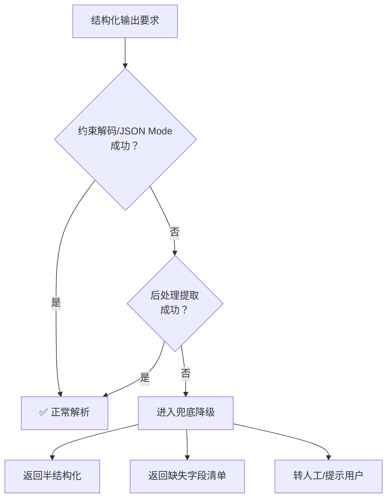
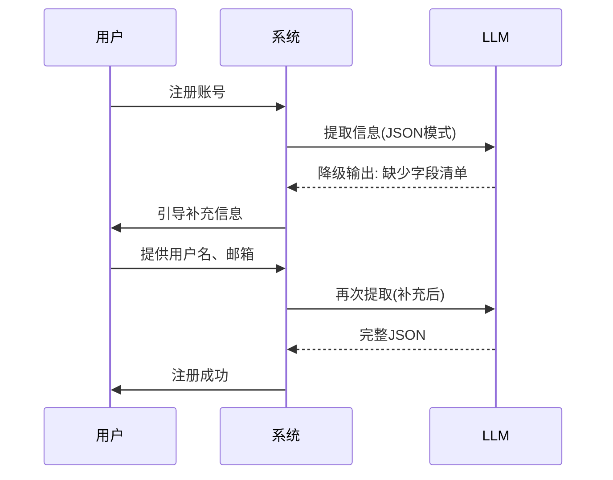
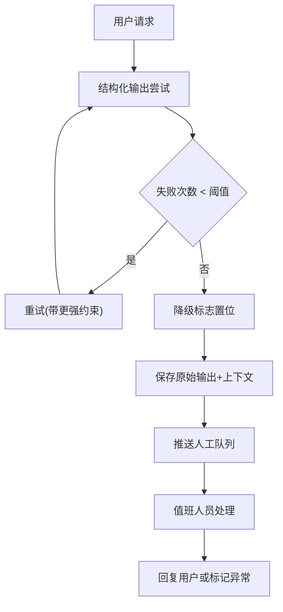
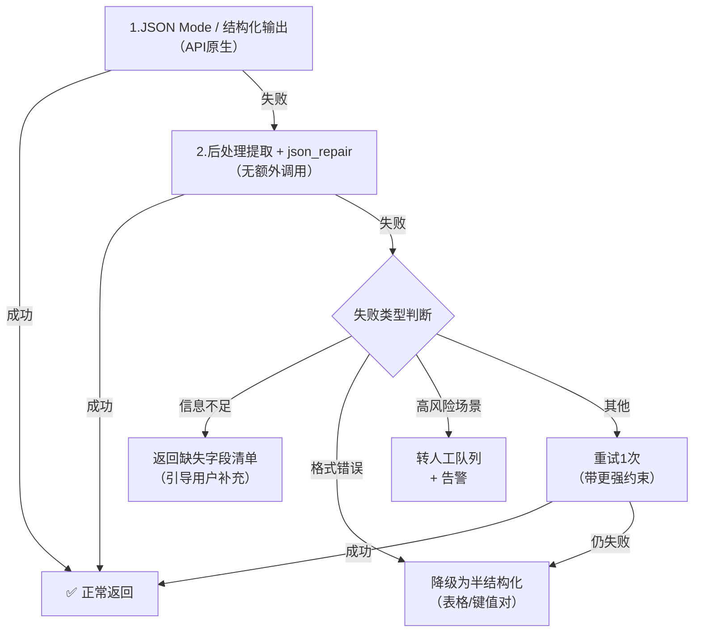

# 当格式输出失败时：重试不是唯一的路

> 三次重试，三次失败。
> 用户等了三倍的时间，你付了三倍的钱，结果还是拿不到能用的 JSON。
> ——也许，该换一条路了。

---

## 引言：重试的代价被低估了

在很多系统中，“失败→重试”是最自然的反应。
但对于 LLM 的结构化输出，重试的代价可能远超你的预期：

| 代价维度 | 典型数值                          |
| -------- | --------------------------------- |
| 延迟     | 单次 1-3 秒 → 重试 3 次 = 3-9 秒 |
| 费用     | 重试 3 次 = 3 倍 Token 费用       |
| 确定性   | 重试 ≠ 成功，可能连续失败        |
| 用户体验 | 长时间无响应 → 用户流失          |

> **重试是“好钢用在刀刃上”的补救手段，不该成为默认策略。**

更好的思路：**先兜底，再降级，最后告知**。

---

## 1. 兜底降级的三种设计思路



---

## 2. 降级方案一：返回“半结构化”数据

### 2.1 适用场景

- 非关键路径（如展示类功能）
- 用户能看懂非完美格式
- 无法承受更高延迟

### 2.2 具体做法

放弃 JSON 的严格机器解析，退一步到**人类可读 + 易于规则解析**的格式。

#### 方案 A：表格（纯文本）

模型输出：

```
| 姓名 | 年龄 | 城市 |
| 张三 | 28   | 北京 |
| 李四 | 32   | 上海 |
```

前端直接渲染为文本表格，或简单正则解析。

#### 方案 B：键值对（每行一个）

模型输出：

```
姓名: 张三
年龄: 28
城市: 北京
---
姓名: 李四
年龄: 32
城市: 上海
```

解析逻辑极简单（按行切分 + 冒号分割）：

```python
def parse_kv(text):
    items = []
    for block in text.split("---"):
        item = {}
        for line in block.strip().split("\n"):
            if ":" in line:
                k, v = line.split(":", 1)
                item[k.strip()] = v.strip()
        if item:
            items.append(item)
    return items
```

#### 方案 C：自然语言 + 模板

模型输出：

```
用户信息如下：
- 姓名：张三
- 年龄：28岁
- 城市：北京
```

人类完全可读，且可以用简单正则兜底抓取。

### 2.3 优缺点

| 优点               | 缺点                      |
| ------------------ | ------------------------- |
| 无需重试，一次成功 | 无法直接 `json.loads()` |
| 延迟最低           | 复杂嵌套结构处理困难      |
| 模型几乎不会失败   | 需要前端或简单解析逻辑    |

---

## 3. 降级方案二：返回“缺失字段清单”

### 3.1 适用场景

- 需要完整结构化数据才能继续（如写入数据库）
- 用户可接受二次输入/补充
- 交互式应用（聊天机器人、表单助手）

### 3.2 具体做法

当模型无法给出完整信息时，让它**明确告诉用户缺了什么**。

**示例对话**：

```
用户: 帮我注册一个账号。

模型: （后台尝试提取 JSON 失败，触发降级）

模型输出:
我无法完成注册，因为缺少以下信息：
- 用户名
- 邮箱地址
- 密码

请提供以上信息后重试。
```

### 3.3 实现方式

在 Prompt 中加入**降级指令**：

```
如果你无法提取全部必填字段，不要尝试编造。
请输出以下格式的信息清单：

缺少以下字段：[字段1, 字段2, ...]
请用户补充后重试。
```

然后主流程根据输出是否以“缺少以下字段”开头，决定走正常解析还是交互式补充。



---

## 4. 降级方案三：转人工审核（高风险场景）

### 4.1 适用场景

- 金融、医疗、法律等高风险领域
- 错误代价极高（如诊断建议、合同条款）
- 合规要求必须有“人回退”

### 4.2 具体做法

当结构化输出失败达到阈值（如连续 2 次失败），自动挂起任务，转入人工队列。

**告警示例**：

```
[LLM输出格式失败告警]
时间: 2025-05-13 10:23:15
用户ID: user_12345
失败原因: JSON解析失败(3次)
原始输出: "根据您的情况，我建议..."
任务ID: task_67890
→ 已转入人工队列 #AI-042，请人工处理。
```

### 4.3 落地架构



> 阈值建议：
>
> - 低风险场景：不需要转人工
> - 中风险（如客服工单）：连续 3 次失败后转人工
> - 高风险（如医疗建议）：第一次失败就转人工 + 告警

---

## 5. 三种降级方案对比

| 维度         | 半结构化           | 缺失字段清单       | 转人工           |
| ------------ | ------------------ | ------------------ | ---------------- |
| 延迟         | 极低（无额外轮次） | 中等（需用户补充） | 高（分钟~小时）  |
| 费用         | 低                 | 中（可能多一轮）   | 极高（人工成本） |
| 自动化程度   | 完全自动           | 半自动（用户参与） | 手动             |
| 适用风险等级 | 低                 | 中                 | 高               |
| 用户体验影响 | 轻微降级           | 可接受             | 较差（等待）     |
| 依赖用户     | 否                 | 是                 | 否（依赖人工）   |

---

## 6. 智能降级策略：根据失败原因选择不同出路

不是所有失败都适合同一种降级方案。

### 失败类型识别

| 失败表现                   | 可能原因              | 推荐降级                    |
| -------------------------- | --------------------- | --------------------------- |
| 输出不含任何结构化标记     | 模型困惑 / 任务太复杂 | 半结构化                    |
| 输出了 JSON 但缺失必填字段 | 信息不足              | 缺失字段清单                |
| 输出格式正确但语义明显错误 | 模型幻觉              | 重试(1次) → 仍失败则转人工 |
| 连续多次 JSON 解析失败     | 模型不稳定            | 转人工                      |
| 输出极短或无意义           | 安全拦截 / 超长输入   | 直接转人工                  |

### 伪代码示例

```python
def structured_extraction_with_fallback(user_input):
    for attempt in range(2):  # 最多2次
        raw = call_llm_with_json_mode(user_input)
        try:
            return json.loads(raw)
        except JSONDecodeError as e:
            last_error = e
            last_output = raw
  
    # 两次都失败，进入降级
    if "missing" in last_output.lower():
        # 模型主动指出了缺什么
        return {"fallback_type": "field_list", "message": last_output}
  
    if is_high_risk_scenario():
        # 高风险场景转人工
        push_to_human_queue(user_input, last_output)
        return {"fallback_type": "human_review", "estimated_wait": "5min"}
  
    # 低风险：返回半结构化
    semi_structured = convert_to_semi_structured(last_output)
    return {"fallback_type": "semi_structured", "data": semi_structured}
```

---

## 7. 完整推荐流程（从最优到兜底）



---

## 8. 写在最后：重试不是免费午餐

每次重试都在消耗：

- ⏱️ 用户的耐心
- 💰 你的 API 费用
- 🧠 模型的置信度（重试本身不增加成功率）

> **好的工程实践不是“失败了就重试”，而是“知道什么时候该降级”。**

| 层级 | 方法                     | 额外代价     |
| ---- | ------------------------ | ------------ |
| 最优 | JSON Mode / 结构化输出   | 0 额外轮次   |
| 补救 | 后处理提取 / json_repair | 0 额外轮次   |
| 降级 | 半结构化（表格/键值对）  | 0 额外轮次   |
| 交互 | 缺失字段清单             | 1 轮用户交互 |
| 兜底 | 转人工                   | 高（人工）   |

> **重试只该用于“临时性问题”（如超时、服务抖动）。
> 对于“模型就是做不到”的系统性失败，降级才是正道。**