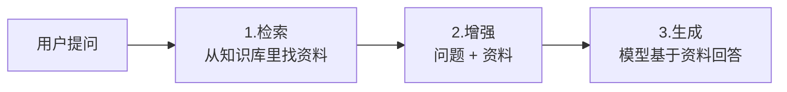
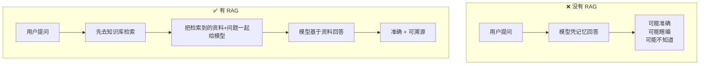
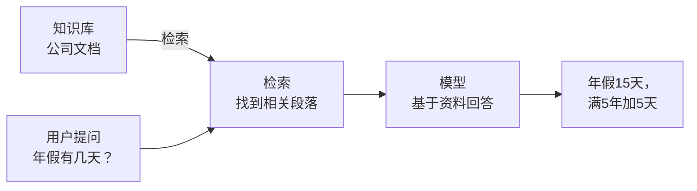
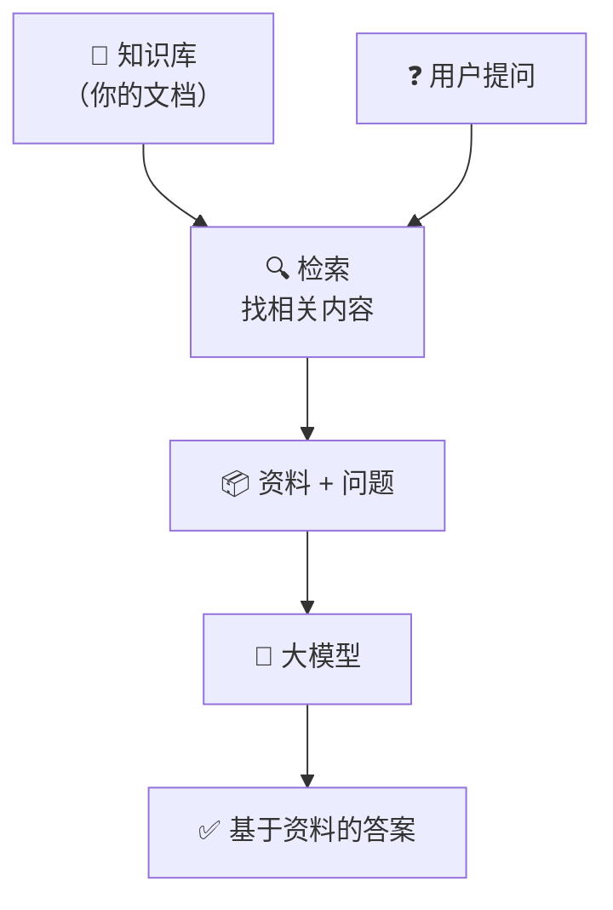

# 什么是 RAG？一个例子让你彻底搞懂

> 大模型很聪明，但它有两个“硬伤”：不知道新知识，还会编瞎话。
> RAG 就是专门解决这两个问题的。

---

## 引言：先看一个例子

你问一个普通的大模型（比如 ChatGPT）：

> “公司今年的年假政策是什么？”

它可能回答：

> “一般来说，年假为5到15天不等，具体请咨询公司HR。”

这个回答看起来合理，但**可能是错的**——因为它不知道你公司的具体政策，只是在“猜”。

现在，如果你先让它**读一下公司发的《2025年年假通知》**，再回答同一个问题：

> “根据公司2025年1月发布的《年假通知》，所有正式员工年假为15天，工作满5年追加5天。”

这个答案**准确、有依据、不瞎编**。

> **让模型“先查资料，再回答”的过程，就是 RAG。**

---

## 1. RAG 是什么？

**RAG** 的全称是 **Retrieval-Augmented Generation**。

中文翻译：**检索增强生成**

拆开来看：

| 部分               | 含义                 | 大白话               |
| ------------------ | -------------------- | -------------------- |
| 检索（Retrieval）  | 从知识库里找相关资料 | “先去翻书查资料”   |
| 增强（Augmented）  | 把资料加到问题里     | “把查到的内容带上” |
| 生成（Generation） | 模型根据资料回答     | “带着书本来答题”   |

> 一句话：**RAG = 让大模型在回答问题之前，先去查资料。**



---

## 2. 没有 RAG vs 有 RAG



|          | 没有 RAG         | 有 RAG                |
| -------- | ---------------- | --------------------- |
| 知识来源 | 只有训练时的记忆 | 记忆 + 外部资料库     |
| 新知识   | ❌ 不知道        | ✅ 随时更新资料库即可 |
| 准确性   | 可能瞎编         | ✅ 有依据             |
| 可溯源   | 不知道答案从哪来 | ✅ 可注明来源         |

---

## 3. RAG 解决了哪两个核心问题？

### 问题一：模型的知识是“过期的”

大模型训练一次要几个月，花几千万美元。
它的知识停留在训练结束的那一刻——比如 GPT-4 只知道 2023 年 10 月之前的事情。

你问它“昨天的重要新闻”，它不知道。

**RAG 的解决办法**：
把今天的新闻放进知识库，模型就能回答今天的问题。

### 问题二：模型会“编瞎话”（幻觉）

当模型不确定答案时，它会编造一个看起来合理的内容。
在严肃场景（医疗、法律、金融），这是致命的。

**RAG 的解决办法**：
强制模型只根据检索到的资料回答。资料里没有就说“不知道”。

---

## 4. RAG 的工作流程（简化版）

只需要理解 **3 个步骤**：

### 步骤 0：准备知识库（做一次）

把你的文档（PDF、网页、笔记）存进一个“知识库”。

### 步骤 1：用户提问

用户问：“年假有几天？”

### 步骤 2：检索

系统去知识库里找到相关的段落。
比如找到：“年假为15天，满5年加5天。”

### 步骤 3：生成

把“问题 + 检索到的资料”一起发给模型，模型基于资料回答。



---

## 5. 一个完整的例子

**场景**：公司客服机器人

**知识库里存放的文档**：

```
文档1：年假政策——正式员工每年15天，满5年工龄追加5天。
文档2：报销流程——发票需在30天内提交，审批需要3个工作日。
文档3：考勤规定——上班时间9:00-18:00，迟到超过30分钟算半天事假。
```

**用户问**：“我工作6年了，年假有多少天？”

**RAG 的过程**：

1. 系统去知识库里找跟“年假”相关的文档
2. 找到文档1：“年假15天，满5年追加5天”
3. 把这段资料和用户问题一起发给模型
4. 模型回答：“根据公司政策，您工作满6年，年假为20天（15天基础 + 5天追加）。”

**用户再问**：“报销需要多久？”

**RAG 的过程**：

1. 系统找到文档2：“审批需要3个工作日”
2. 模型回答：“根据公司规定，报销审批需要3个工作日。”

> 每次提问都重新检索，每次回答都有依据。

---

## 6. RAG 的核心组成部分

虽然原理很简单，但 RAG 系统需要三个东西配合工作：

| 组件          | 它做什么               | 通俗理解               |
| ------------- | ---------------------- | ---------------------- |
| 文档切块      | 把长文档切成小段       | 把一本书拆成一页一页   |
| Embedding模型 | 把文字转成数字（向量） | 给每页内容编个“指纹” |
| 向量数据库    | 存储和快速查找         | 图书馆的索引卡         |

> **它们合起来，让“检索”这件事变得又快又准。**

---

## 7. 什么时候该用 RAG？

| 场景                     | 需要 RAG 吗？       |
| ------------------------ | ------------------- |
| 闲聊、写诗、头脑风暴     | 不需要              |
| 回答公司内部政策         | ✅ 需要             |
| 基于最新新闻回答问题     | ✅ 需要             |
| 医疗/法律/金融等严肃领域 | ✅ 需要（减少幻觉） |
| 回答你个人笔记里的内容   | ✅ 需要             |
| 需要注明信息来源的场景   | ✅ 需要             |

> 一句话：**需要“准确 + 可溯源”的场景，就用 RAG。**

---

## 8. 一张图记住 RAG



---

## 写在最后

RAG 不改变模型本身，而是改变了**模型回答问题的方式**：

- **之前**：模型靠“背诵”回答（闭卷考试）
- **之后**：模型先“查资料”再回答（开卷考试）

> 最妙的是：你不需要重新训练模型。
> 只需要换一个知识库，模型就能回答完全不同领域的问题。