# RAG 完全指南：从核心原理到高级技术

> RAG 让大模型从“闭卷考试”变成“开卷考试”。
> 这篇文章从零开始，讲透 RAG 的每一个核心环节，以及让效果更好的高级技术。

---

## 引言：RAG 是什么？

**RAG** = **R**etrieval **A**ugmented **G**eneration（检索增强生成）

核心思想：在让模型回答问题**之前**，先从外部知识库中**检索**相关信息，然后把“检索到的内容 + 用户问题”一起交给模型，让它**基于这些资料**来回答。

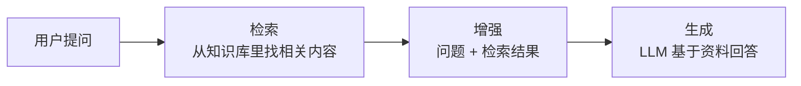

---

## 第一部分：RAG 的核心组成

RAG 系统由 **五个核心环节** 组成：

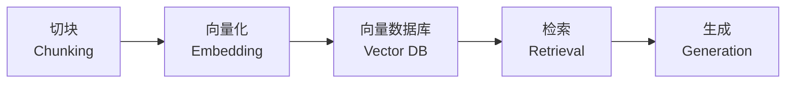

---

### 1. 切块（Chunking）

**做什么**：把长文档切成一个个小片段（Chunk）。

**为什么需要**：

- 模型上下文窗口有限
- 小块更容易精确命中用户问题
- 避免不相关信息干扰

**技术要点**：

| 参数       | 说明         | 典型值        |
| ---------- | ------------ | ------------- |
| chunk_size | 每个块的大小 | 200-500 Token |
| overlap    | 块之间的重叠 | 50-100 Token  |

**为什么需要 overlap**：防止重要信息正好被切在边界上而丢失。

```python
# 切块示例
def chunk_text(text, chunk_size=500, overlap=50):
    words = text.split()
    chunks = []
    for i in range(0, len(words), chunk_size - overlap):
        chunk = " ".join(words[i:i + chunk_size])
        chunks.append(chunk)
    return chunks
```

> 💡 切块太小 → 丢失上下文；切块太大 → 检索不够精确。

---

### 2. 向量化（Embedding）

**做什么**：把文本片段转换成**向量**（一串有意义的数字）。

**核心原理**：

- 语义相似的文本，它们的向量在空间中的位置也相近
- 模型通过计算向量之间的距离来判断文本相似度

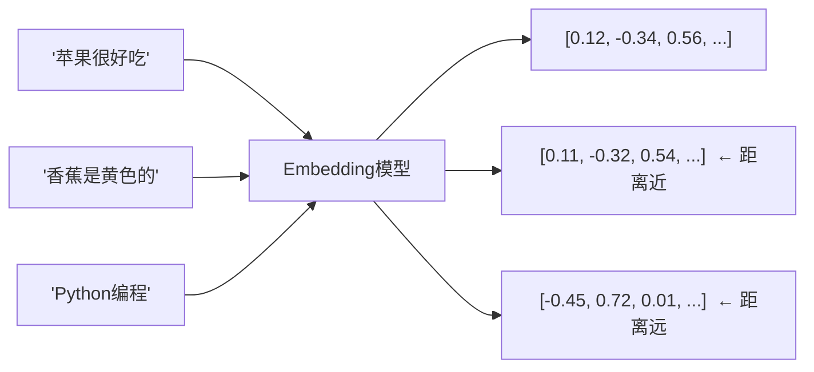

**常用 Embedding 模型**：

| 模型                              | 维度 | 特点           |
| --------------------------------- | ---- | -------------- |
| OpenAI `text-embedding-3-small` | 1536 | 通用，便宜     |
| OpenAI `text-embedding-3-large` | 3072 | 精度更高       |
| BGE (BAAI)                        | 1024 | 开源，中文友好 |
| Cohere `embed-english-v3`       | 1024 | 多语言支持     |

> 关键约束：**问题和文档块必须使用同一个 Embedding 模型**。

---

### 3. 向量数据库（Vector Database）

**做什么**：存储向量并支持高效的相似度搜索。

**为什么需要**：

- 不是普通数据库（普通数据库只能精确匹配）
- 向量数据库为“找最相似的向量”专门优化

**核心算法**：ANN（Approximate Nearest Neighbor，近似最近邻）
不找“绝对最相似”，而是找一个“足够好”的结果，速度提升几百倍。

**常用向量数据库**：

| 数据库   | 特点              | 适用场景             |
| -------- | ----------------- | -------------------- |
| Chroma   | 轻量，嵌入式      | 本地开发、原型       |
| FAISS    | 纯库，极快        | 高性能、自托管       |
| Pinecone | 全托管云服务      | 生产环境、免运维     |
| Qdrant   | Rust 编写，性能好 | 高并发场景           |
| Milvus   | 分布式            | 超大规模（亿级向量） |

```python
# Chroma 示例
import chromadb

client = chromadb.Client()
collection = client.create_collection("my_docs")

# 存入
collection.add(
    documents=["苹果很好吃", "香蕉是黄色的"],
    ids=["doc1", "doc2"]
)

# 查询
results = collection.query(
    query_texts=["水果味道"],
    n_results=1
)
```

---

### 4. 检索（Retrieval）

**做什么**：从向量数据库中找到与用户问题最相关的文档片段。

**检索流程**：

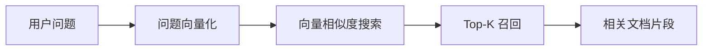

**两种检索方式**：

| 方式               | 原理     | 适用场景               |
| ------------------ | -------- | ---------------------- |
| 向量检索           | 语义匹配 | 理解含义的场景         |
| 关键词检索（BM25） | 词法匹配 | 精确匹配（如产品型号） |

**核心参数**：

| 参数  | 含义           | 典型值 |
| ----- | -------------- | ------ |
| Top-K | 召回多少个片段 | 3-10   |

---

### 5. 生成（Generation）

**做什么**：把检索到的资料和用户问题一起交给 LLM，生成最终答案。

**Prompt 模板**：

```
你是一个专业的问答助手。请仅基于以下【参考资料】回答问题。

【参考资料】
{documents}

【用户问题】
{question}

要求：
1. 只使用参考资料中的信息
2. 如果参考资料中没有答案，回答"根据现有资料，我无法回答这个问题"
3. 可以在答案末尾注明信息来源
```

**生成阶段的关键约束**：

| 约束       | 作用       |
| ---------- | ---------- |
| 只使用资料 | 减少幻觉   |
| 承认不知道 | 避免瞎编   |
| 可溯源     | 增加可信度 |

---

## 第二部分：RAG 的完整工作流

### 阶段一：索引（离线，一次性准备）

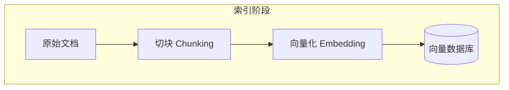

### 阶段二：查询（在线，每次请求）

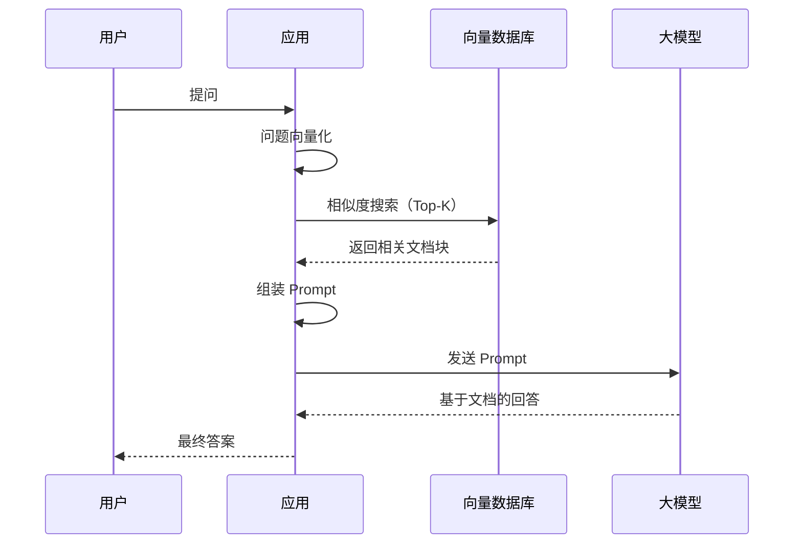

### 一个完整的例子

**知识库文档**：

```
文档A：正式员工年假为15天，工作满5年追加5天。
文档B：年假需在次年3月底前休完。
```

**用户问**：“我工作6年了，年假有几天？”

**RAG 执行过程**：

1. 问题向量化 → 得到问题向量
2. 检索 → 找到文档A（相似度0.92）、文档B（相似度0.78）
3. 构造 Prompt → 将文档A、B与问题一起发给 LLM
4. 生成 → “根据公司规定，您工作满6年，年假为20天（15天基础+5天追加）。请在次年3月底前休完。”

---

## 第三部分：高级 RAG 技术

基础 RAG 已经能用，但存在一些问题。高级技术针对性地解决这些问题。

### 问题一：检索结果不够准

#### 技术 1：混合检索（Hybrid Search）

**问题**：向量检索擅长语义匹配，但精确词匹配有时更好（比如查型号“ABC-123”）。

**解决**：向量检索 + 关键词检索（BM25）+ 结果融合。

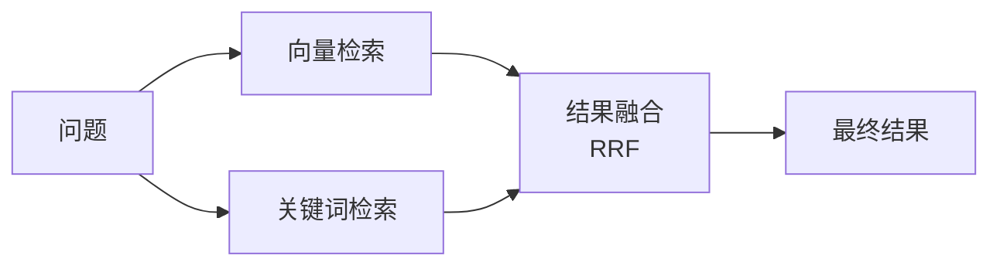

#### 技术 2：重排序（Reranking）

**问题**：向量检索召回的 Top-K 中，排在前面的不一定最相关。

**解决**：多召回一些（如 Top-20），用更精准的**重排序模型**重新打分，再取 Top-5。

```python
# 伪代码
retrieved = vector_search(query, k=20)      # 多召一些
reranked = reranker.rerank(query, retrieved) # 重排序
final = reranked[:5]                         # 留前5个
```

#### 技术 3：查询改写（Query Rewriting）

**问题**：用户的口语化问题检索效果差。

**解决**：用 LLM 先把问题改写成更适合检索的形式。

| 用户原问                   | 改写后                     |
| -------------------------- | -------------------------- |
| “那个红色的水果有啥好处” | “红色水果 营养 健康益处” |

---

### 问题二：丢失上下文信息

#### 技术 4：父子文档检索（Parent-Child Retrieval）

**问题**：小块检索精确但丢失上下文；大块有上下文但检索不准。

**解决**：存的时候，把文档切成小块（用于检索），同时保留对应的父块（大块，用于生成）。

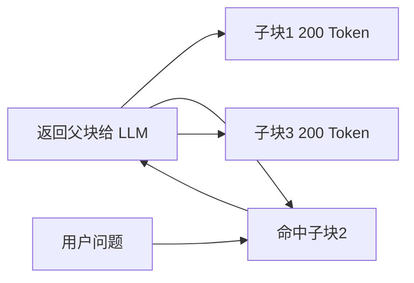

> 检索命中子块，但交给 LLM 的是包含完整上下文的父块。

#### 技术 5：句子窗口检索（Sentence Window Retrieval）

**原理类似**：检索命中一个句子，但返回该句子前后的一个窗口。

---

### 问题三：信息丢失在“中间”

#### 技术 6：RAPTOR（递归摘要树）

**问题**：长文档按固定大小切块后，跨块的高层语义会丢失。

**解决**：递归聚类 - 聚类相似的块 → 生成摘要 → 对摘要再聚类 → 形成树状结构。

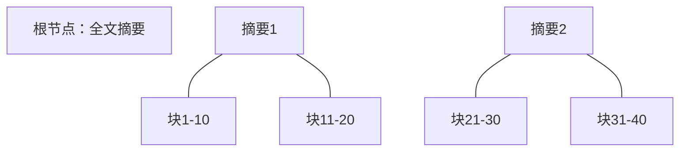

---

### 问题四：多轮检索

#### 技术 7：Self-RAG（自我反思检索）

**问题**：基础 RAG 只检索一次，可能信息不够。

**解决**：模型在生成过程中自我评估：信息够不够？需不需要再搜一次？

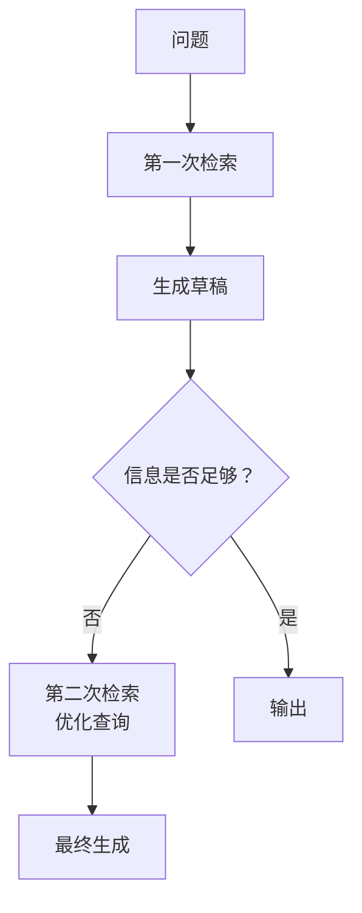

---

### 问题五：响应速度

#### 技术 8：缓存检索结果

**问题**：相同的或相似的问题重复检索。

**解决**：缓存高频问题的检索结果，命中缓存直接返回。

---

## 高级 RAG 技术全景图

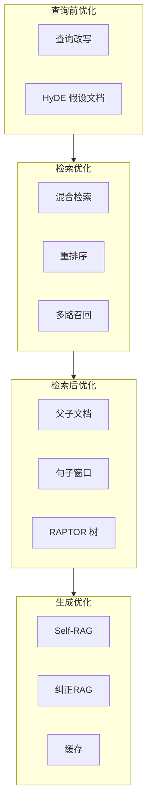

---

## 基础 RAG vs 高级 RAG

| 维度   | 基础 RAG     | 高级 RAG            |
| ------ | ------------ | ------------------- |
| 检索   | 单次向量检索 | 混合检索 + 重排序   |
| 查询   | 用户原问题   | 查询改写 + 多轮检索 |
| 上下文 | 固定大小切块 | 父子文档 / 句子窗口 |
| 生成   | 一次性生成   | Self-RAG / 反思机制 |
| 效果   | 基础可用     | 显著提升            |
| 复杂度 | 低           | 中高                |

---

## 总结：RAG 全景图

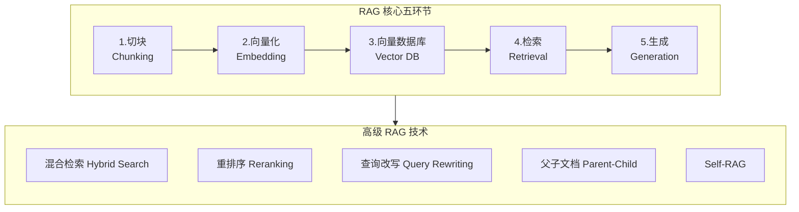

| 层级       | 内容                                         |
| ---------- | -------------------------------------------- |
| 核心五环节 | 切块 → 向量化 → 向量数据库 → 检索 → 生成 |
| 基础优化   | 混合检索、重排序、查询改写                   |
| 上下文优化 | 父子文档、句子窗口、RAPTOR                   |
| 智能检索   | Self-RAG、缓存                               |

---

## 写在最后

RAG 的本质没有变：

> **检索 + 生成 = 更准确的答案**

基础 RAG 让你快速搭建一个可用系统。
高级 RAG 让系统从“能用”变成“好用”。

选择哪些技术，取决于你的场景：

- 简单问答 → 基础 RAG 足够
- 复杂文档、高准确率要求 → 逐渐引入高级技术