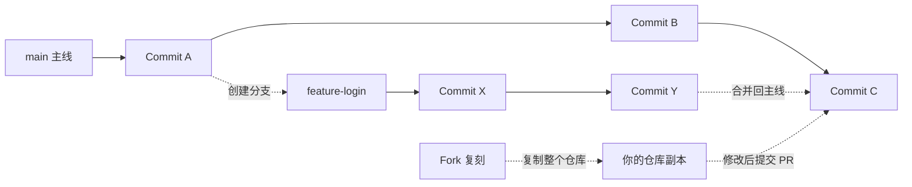

# 02 · 探索与发现

> **这篇的目标**：学会在 GitHub 上发现好项目、用高级搜索精准定位代码、创建自己的第一个仓库、理解 GitHub 的核心名词和概念关系。

---

## 1. 发现好项目的入口

登录 GitHub 后，点击左上角的 ☰ **Open menu** 打开左侧边栏，在**发现**区域可以看到：

| 入口 | 链接 | 作用 |
|------|------|------|
| **Explore** | /explore | 推荐项目，基于你的 Star 和兴趣 |
| **Marketplace** | /marketplace | Actions、Apps 等第三方工具市场 |
| **MCP registry** | /mcp | MCP（Model Context Protocol）注册表 |

### 1.1 Explore 页面导航

进入 /explore 后，顶部有一行二级导航标签：

| 标签 | 作用 |
|------|------|
| **Explore** | 推荐项目（基于你的 Star 和兴趣） |
| **Topics** | 按主题分类浏览 |
| **Trending** | 今日/本周/本月趋势项目 |
| **Collections** | GitHub 官方整理的精选合集 |
| **Events** | 开源活动与会议 |
| **GitHub Sponsors** | 赞助开源项目 |

### 1.2 Explore 主内容区

Explore 页面主要展示基于你兴趣的推荐项目，每个推荐卡片包含仓库名、描述、Star 数、主题标签、最近更新时间，以及 Code / Issues / Pull requests 快捷入口。

> 💡 **小技巧**：多给感兴趣的项目点 Star，Explore 的推荐会越来越精准。

### 1.3 Trending 趋势页面

在 Explore 导航中点击 **Trending**，进入 /trending。可按语言和时间范围（Today / This week / This month）筛选，展示每项目的 Star 增长数。

> 💡 **小技巧**：每天看看 Trending 是了解技术潮流的好习惯。

### 1.4 Topics 主题页面

点击 **Topics** 进入 /topics，可以看到所有热门技术主题，点击某个主题可查看该主题下的热门仓库和详细介绍。

---

## 3. 核心名词扫盲

| 名词 | 英文 | 大白话解释 |
|------|------|-----------|
| **仓库** | Repository | GitHub 最基本单位，一个项目的文件夹。名称格式：用户名/仓库名 |
| **分支** | Branch | 代码的独立版本线。默认分支叫 main。创建分支开发新功能，完成后合并回去 |
| **提交** | Commit | 一次修改的保存记录，类似游戏存档点。每个 commit 有唯一 ID |
| **拉取请求** | Pull Request / PR | 把修改合入主分支前的审核请求。其他开发者可以审查代码、提意见 |
| **问题** | Issue | 报告 Bug、提需求、问问题。像论坛帖子，可回复、贴标签、指派 |
| **复刻** | Fork | 把别人仓库完整复制到你账号下，可随意修改，通过 PR 贡献回原仓库 |
| **收藏** | Star | 相当于点赞收藏。Star 数是项目流行度的重要指标 |
| **关注** | Watch | 接收仓库动态通知。三种模式：Participating（默认）、All、Ignore |
| **克隆** | Clone | 把远程仓库下载到本地。命令：git clone <仓库地址> |
| **发布** | Release | 给仓库打版本标签（如 v1.0.0），附发布说明和下载附件 |

---

## 4. 核心概念关系图

**图解**：

| 符号 | 含义 |
|------|------|
| 实线 → | Commit 按顺序前进 |
| 虚线 -.→ | 创建或合并分支 |
| Fork | 复制别人仓库到你的账号 |
| PR | 把你的修改提交给原仓库 |

**一句话流程**：从 main 创建分支 → 多次 commit → 合并回主线 → Fork 他人仓库 → 修改后提交 PR。

---

## 5. 高级搜索

在任意页面按 / 键跳转到搜索框。

### 筛选类型

| 筛选 | 说明 |
|------|------|
| Repositories | 搜仓库 |
| Code | 搜代码内容 |
| Issues | 搜 Issue |
| Pull Requests | 搜 PR |
| Users | 搜用户 |
| Topics | 搜主题 |
| Wikis | 搜 Wiki |

### 高级搜索语法

| 语法 | 示例 | 作用 |
|------|------|------|
| stars:>1000 | stars:>1000 language:python | Star 超 1000 的 Python 项目 |
| pushed:>2025-01-01 | pushed:>2025-01-01 | 近期活跃的仓库 |
| language:javascript | language:javascript | JS 项目 |
| topic:ai | topic:ai | AI 主题项目 |
| user:facebook | user:facebook | 某组织下所有仓库 |
| repo:facebook/react | repo:facebook/react | 限定仓库内搜索 |
| is:issue is:open | is:issue is:open label:bug | 未解决的 Bug |
| license:mit | license:mit | MIT 许可证项目 |

> 💡 可以组合使用：stars:>5000 language:rust pushed:>2025-06-01

### 高级搜索页面

访问 /search/advanced，通过表单选择条件构建搜索。

---

## 6. 个人 Stars 管理

头像下拉菜单 → **Your stars**（或访问 /stars），可查看和管理所有 Star 过的仓库：

- **按主题筛选**：点击主题标签快速筛选
- **按语言筛选**：根据编程语言过滤
- **搜索**：在已 Star 的仓库中搜索
- **Lists**：归类到不同的列表中管理

> 💡 定期整理 Stars，创建 Lists（如"前端工具""学习资源"）。

---

## 小结

- [x] 通过 Explore / Trending / Topics 发现好项目
- [x] 创建了自己的第一个仓库
- [x] 理解所有核心名词含义
- [x] 会看核心概念关系图
- [x] 会用高级搜索语法
- [x] 知道怎么管理 Stars

**下一篇**：学习仓库页面详解——看懂仓库布局、标签栏、文件浏览，并创建自己的第一个仓库。

---

## 快速自查清单

- [ ] 我知道 Explore、Trending、Topics 的区别
- [ ] 我创建了自己的第一个仓库
- [ ] 我能说出 Repository、Branch、Commit、PR、Issue 的区别
- [ ] 我能在搜索框中使用高级语法
- [ ] 我会管理自己的 Stars
